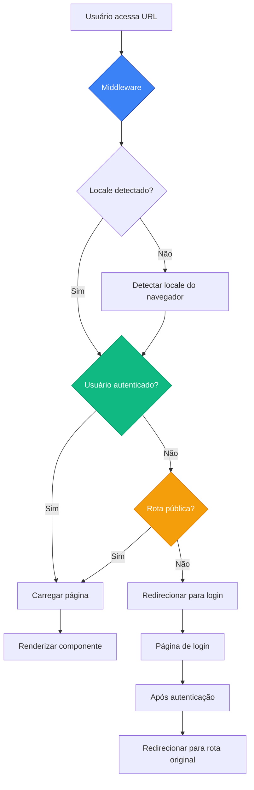

# Estrutura Geral da Aplicação

## 📁 Organização de Diretórios

### Estrutura Raiz
```
ai-coders-starter-kit/
├── agents/                 # Documentação e guias para agentes IA
├── docs/                   # Documentação completa do projeto
├── messages/               # Arquivos de internacionalização (pt-BR, en)
├── public/                 # Assets estáticos
├── src/                    # Código fonte da aplicação
├── supabase/              # Migrações e configurações do Supabase
├── .env.example           # Exemplo de variáveis de ambiente
├── package.json           # Dependências e scripts
├── next.config.mjs        # Configuração do Next.js 15
├── tailwind.config.ts     # Configuração do Tailwind CSS
└── tsconfig.json          # Configuração do TypeScript
```

### Diretório `src/`
```
src/
├── app/                    # App Router do Next.js 15
│   ├── [locale]/          # Rotas internacionalizadas
│   ├── api/               # API Routes (públicas e protegidas)
│   ├── layout.tsx         # Layout raiz da aplicação
│   └── providers.tsx      # Providers globais (Clerk, TanStack Query, Zustand)
├── components/            # Componentes reutilizáveis
├── config/                # Configurações centralizadas
├── hooks/                 # Custom hooks (queries, mutations, utilities)
├── i18n/                  # Configuração de internacionalização
├── lib/                   # Bibliotecas e utilitários
├── store/                 # Stores Zustand (app, auth, ui, locale)
├── types/                 # Definições de tipos TypeScript
└── utils/                 # Funções utilitárias
```

## 🏗️ Arquitetura da Aplicação

### Diagrama de Arquitetura

```mermaid
graph TB
    subgraph "Frontend - Next.js 15"
        A[App Router] --> B[Páginas]
        A --> C[Componentes]
        A --> D[Hooks]
        
        B --> B1[Dashboard]
        B --> B2[Auth]
        B --> B3[Profile]
        B --> B4[Tables]
        
        C --> C1[UI Components]
        C --> C2[Layout Components]
        C --> C3[Chart Components]
        C --> C4[Form Components]
    end
    
    subgraph "Styling & Theme"
        E[Tailwind CSS]
        F[next-themes]
        G[CSS Variables]
    end
    
    subgraph "Internacionalização"
        H[next-intl]
        I[Messages PT-BR]
        J[Messages EN]
    end
    
    subgraph "Autenticação"
        K[Clerk Provider]
        L[Auth Guard]
        M[OAuth Providers]
    end
    
    subgraph "Data & Services"
        N[Chart Services]
        O[User Services]
        P[API Client]
    end
    
    A --> E
    A --> H
    A --> K
    A --> N
    
    style A fill:#3b82f6,stroke:#1e40af,color:#fff
    style K fill:#10b981,stroke:#059669,color:#fff
    style H fill:#f59e0b,stroke:#d97706,color:#fff
    style E fill:#8b5cf6,stroke:#7c3aed,color:#fff
```


### Tecnologias Principais
- **Framework**: Next.js 15.3.3 com App Router
- **UI**: React 19.0.0 + TypeScript
- **Estilização**: Tailwind CSS + Radix UI
- **Autenticação**: Clerk (com webhooks)
- **Banco de Dados**: Supabase (PostgreSQL + Realtime)
- **Estado Client**: Zustand
- **Estado Server**: TanStack Query
- **Formulários**: React Hook Form + Zod
- **Internacionalização**: next-intl (pt-BR, en)
- **Tema**: next-themes
- **Gráficos**: ApexCharts
- **Notificações**: Sonner (toasts)
- **Ícones**: Lucide Icons
- **Analytics**: GA, GTM, Meta Pixel, LogRocket

### Padrões Arquiteturais

#### 1. **Nova App Router Structure (Landing + App)**
```
app/
├── [locale]/              # Locale dinâmico para i18n
│   ├── page.tsx          # 🏠 LANDING PAGE (Entrada principal)
│   ├── _components/      # Componentes da landing page
│   ├── auth/             # 🔐 Páginas de autenticação (público)
│   ├── app/              # 📱 APLICAÇÃO (área protegida)
│   │   ├── layout.tsx    # Layout da aplicação (AuthGuard + Sidebar)
│   │   ├── (home)/       # Dashboard principal  
│   │   ├── settings/     # Configurações da aplicação
│   │   ├── profile/      # Páginas de perfil
│   │   └── (exemplo)/    # 🗑️ PÁGINAS DE EXEMPLO (podem ser deletadas)
│   │       ├── calendar/     # Página de calendário
│   │       ├── charts/       # Páginas de gráficos
│   │       ├── forms/        # Páginas de formulários
│   │       ├── pages/        # Páginas diversas
│   │       ├── tables/       # Páginas de tabelas
│   │       ├── ui-elements/  # Páginas de elementos UI
│   │       ├── api-demo/     # Demonstração de API
│   │       ├── state-management/ # Gerenciamento de estado
│   │       └── tanstack-query/   # TanStack Query
│   └── layout.tsx        # Layout localizado
```

#### 2. **Component Architecture**
```
components/
├── Layouts/                # Componentes de layout
│   ├── header/            # Cabeçalho com notificações, tema, idioma
│   │   ├── notification/  # Sistema de notificações real-time
│   │   ├── theme-toggle/  # Alternador de tema
│   │   └── user-menu/     # Menu do usuário
│   ├── sidebar/           # Sidebar com navegação
│   └── footer/            # Rodapé da aplicação
├── Charts/                # Componentes de gráficos
│   ├── CampaignVisitors/  # Visitantes de campanha
│   ├── PaymentsOverview/  # Visão de pagamentos
│   ├── UsedDevices/       # Dispositivos usados
│   └── WeeksProfit/       # Lucro semanal
├── Tables/                # Componentes de tabelas
├── FormElements/          # Elementos de formulário
│   ├── Checkboxes/        # 5 variações de checkbox
│   ├── DatePicker/        # 2 tipos de seletor de data
│   ├── InputGroup/        # Grupos de input
│   ├── MultiSelect/       # Seleção múltipla
│   ├── SelectGroup/       # Grupos de seleção
│   ├── Switchers/         # 4 tipos de switches
│   └── Textarea/          # Áreas de texto
├── LandingPage/           # Componentes da landing page
│   ├── Hero/              # Seção hero
│   ├── Features/          # Recursos
│   ├── Pricing/           # Preços
│   └── Testimonials/      # Depoimentos
├── ui/                    # Componentes base de UI
│   ├── alert/             # Alertas e notificações
│   ├── badge/             # Badges com variantes
│   ├── button/            # Botões customizados
│   ├── dialog/            # Modais e diálogos
│   ├── dropdown/          # Menus dropdown
│   ├── loading-states/    # Estados de carregamento
│   ├── skeleton/          # Skeletons para loading
│   ├── spinner/           # Spinners animados
│   └── toast/             # Sistema de toasts
├── WhatsApp/              # Widget do WhatsApp
├── auth-guard.tsx         # Proteção de rotas
└── test/                  # Componentes de teste
    └── NotificationTester.tsx
```

## 🔧 Sistema de Roteamento

### Fluxo de Roteamento


### Internacionalização de Rotas
- **Locales suportados**: `pt-BR`, `en`
- **Rota padrão**: `/pt-BR`
- **Middleware**: Redirecionamento automático baseado no locale do navegador

### Nova Estrutura de Páginas

#### Páginas Públicas
- **Landing Page**: `/` (entrada principal - marketing)
- **Autenticação**: `/auth/sign-in`, `/auth/sign-up`

#### Aplicação Protegida (prefixo `/app/`)
- **Dashboard**: `/app/dashboard` (área principal)
- **Calendário**: `/app/calendar`
- **Gráficos**: `/app/charts/*`
- **Formulários**: `/app/forms/*`
- **Tabelas**: `/app/tables`
- **Perfil**: `/app/profile`
- **Configurações**: `/app/settings`
- **Elementos UI**: `/app/ui-elements/*`
- **API Demo**: `/app/api-demo`
- **Estado**: `/app/state-management`
- **TanStack Query**: `/app/tanstack-query`

### Vantagens da Nova Arquitetura

#### 🏠 Separação Landing + App
1. **SEO Otimizado**: Landing page dedicada para marketing e conversão
2. **Performance**: Cada contexto carrega apenas recursos necessários
3. **Manutenibilidade**: Código organizado por responsabilidade
4. **Escalabilidade**: Evolução independente de cada área

#### 🔒 Segurança
- **AuthGuard**: Proteção automática das rotas `/app/*`
- **Layouts Condicionais**: Diferentes layouts por contexto
- **Redirecionamento Inteligente**: Baseado no status de autenticação

#### 🎯 Experiência do Usuário
- **Fluxo Natural**: Landing → Auth → App
- **Contextos Claros**: Marketing vs Aplicação
- **Navegação Otimizada**: Sidebar apenas na aplicação

### 🗑️ Pasta `(exemplo)` - Elementos Removíveis

A pasta `src/app/[locale]/app/(exemplo)/` contém páginas e componentes de demonstração que podem ser **completamente removidos** ao iniciar um novo projeto:

#### Conteúdo da Pasta (exemplo)
```
(exemplo)/
├── api-demo/        # Demonstração de APIs
├── calendar/        # Exemplo de calendário
├── charts/          # Exemplos de gráficos
│   └── basic-chart/ # Gráfico básico
├── dashboard/       # Dashboard de exemplo
├── forms/           # Exemplos de formulários
│   ├── form-elements/   # Elementos de formulário
│   ├── form-layout/     # Layout de formulários
│   └── validated-forms/ # Formulários validados
├── state-management/    # Exemplo de gerenciamento de estado
├── tables/          # Exemplos de tabelas
├── tanstack-query/  # Exemplo TanStack Query
└── ui-elements/     # Exemplos de elementos UI
    ├── alerts/      # Alertas
    ├── badges/      # Badges
    ├── buttons/     # Botões
    ├── carousels/   # Carrosséis
    ├── dialogs/     # Diálogos
    ├── drawers/     # Drawers
    ├── spinners/    # Spinners
    └── toasts/      # Toasts
```

#### Quando Remover
✅ **PODE REMOVER** quando:
- Iniciando um novo projeto do zero
- Não precisa dos exemplos de UI/funcionalidade
- Quer reduzir o tamanho do projeto
- Quer focar apenas na funcionalidade essencial

❌ **MANTENHA** quando:
- Está aprendendo o sistema
- Quer exemplos de implementação
- Precisa de referência para novos componentes
- Está explorando as funcionalidades disponíveis

#### Como Remover
```bash
# Remove toda a pasta de exemplos
rm -rf src/app/[locale]/app/\(exemplo\)/

# Remove referências no sistema de navegação
# Edite: src/hooks/useNavigation.ts
# Remova os items do menu relacionados aos exemplos
```

#### Impacto da Remoção
- ✅ **Reduz bundle size** significativamente
- ✅ **Simplifica navegação** (menos itens no menu)
- ✅ **Foco no essencial** para desenvolvimento
- ⚠️ **Perde exemplos** de implementação

## 🎨 Sistema de Design

### Tema
- **Dark Mode**: Suporte completo com next-themes
- **Cores**: Sistema baseado em CSS variables
- **Tipografia**: Fonte Satoshi (custom)
- **Responsividade**: Mobile-first approach

### Componentes Base
- **Button**: Botões com variantes e estados
- **Alert**: Notificações e alertas
- **Badge**: Componente de badge com múltiplas variantes e suporte a ícones
- **Spinner**: Indicadores de loading com 5 variantes visuais e LoadingOverlay
- **Toast**: Sistema de notificações toast com suporte a promises e ações
- **Table**: Tabelas responsivas
- **Dropdown**: Menus dropdown
- **Skeleton**: Loading states

## 🔐 Sistema de Autenticação

### Clerk Integration
- **Provider**: Configurado em `app/providers.tsx`
- **Rotas Protegidas**: Middleware automático
- **OAuth**: Suporte a Google, GitHub, etc.
- **Páginas**: Sign-in, Sign-up com SSO callback

### Auth Guard
- **Componente**: `components/auth-guard.tsx`
- **Redirecionamento**: Automático para login se não autenticado

## 🌍 Internacionalização

### next-intl Configuration
- **Configuração**: `i18n/` directory
- **Navegação**: `i18n/navigation.ts`
- **Roteamento**: `i18n/routing.ts`
- **Middleware**: Detecção automática de locale

### Arquivos de Tradução
- **Português**: `messages/pt-BR.json`
- **Inglês**: `messages/en.json`

## 📊 Estado da Aplicação

### Providers Principais (em `app/providers.tsx`)
- **ClerkProvider**: Autenticação e sessão
- **QueryClientProvider**: TanStack Query
- **ThemeProvider**: Tema dark/light
- **ZustandProvider**: Sincronização de stores
- **SidebarProvider**: Estado da sidebar
- **ToastProvider**: Sistema de notificações

### Arquitetura de Gerenciamento de Estado

#### 1. **Estado do Cliente (Zustand)**
```typescript
// stores/
├── app-store.ts      # Estado geral da aplicação
├── auth-store.ts     # Estado de autenticação
├── ui-store.ts       # Estado da UI (tema, sidebar, toasts)
└── locale-store.ts   # Estado de internacionalização
```

**Uso:**
- Preferências do usuário
- Estado da UI (sidebar aberta/fechada, tema)
- Notificações temporárias (toasts)
- Configurações locais

#### 2. **Estado do Servidor (TanStack Query)**
```typescript
// hooks/
├── api/              # Funções puras de API
├── queries/          # Hooks de leitura (GET)
└── mutations/        # Hooks de escrita (POST, PUT, DELETE)
```

**Uso:**
- Dados do banco (usuários, posts, notificações)
- Cache inteligente
- Optimistic updates
- Background refetch

#### 3. **Hooks Customizados**
```typescript
// hooks/
├── useAppConfig.ts           # Configurações da aplicação
├── useRealtimeNotifications.ts  # Notificações real-time
├── useThemeSync.ts           # Sincronização de tema
├── useLocaleSync.ts          # Sincronização de idioma
├── useStoreSync.ts           # Sincronização Clerk + Zustand
├── useCepLookup.ts           # Busca de CEP brasileiro
└── useFormValidation.ts      # Validação de formulários
```

## 🚀 Performance

### Otimizações
- **Code Splitting**: Automático com Next.js
- **Image Optimization**: Next.js Image component
- **Font Optimization**: Fonte local Satoshi
- **CSS**: Tailwind CSS com purge automático

### Loading States
- **NextTopLoader**: Barra de progresso global
- **Skeleton**: Componentes de loading
- **Suspense**: Fallbacks para componentes

## ⚙️ Sistema de Configuração

### Feature Flags (`config/appConfig.ts`)
```typescript
{
  enableAuth: true,           // Sistema de autenticação
  enableI18n: true,          // Internacionalização
  enableDarkMode: true,      // Modo escuro
  enableFormValidation: true, // Validação de formulários
  enableCepLookup: true,     // Busca de CEP
  enableAnalytics: true,     // Analytics
  maintenanceMode: false,    // Modo de manutenção
}
```

### Analytics Configurados
- **Google Analytics**: GA4 tracking
- **Google Tag Manager**: GTM container
- **Meta Pixel**: Facebook tracking
- **LogRocket**: Session replay

### Integrações Externas
- **Clerk**: Autenticação e gerenciamento de usuários
- **Supabase**: Banco de dados e real-time
- **ViaCEP**: API brasileira de endereços
- **WhatsApp**: Widget de contato
- **Webhooks**: Integração com n8n, Zapier, Make

## 📱 Responsividade

### Breakpoints (Tailwind)
- **sm**: 640px
- **md**: 768px
- **lg**: 1024px
- **xl**: 1280px
- **2xl**: 1536px

### Mobile-First
- Design responsivo com abordagem mobile-first
- Sidebar colapsível em dispositivos móveis
- Componentes adaptáveis para diferentes telas
- Hook `useIsMobile()` para detecção de dispositivo