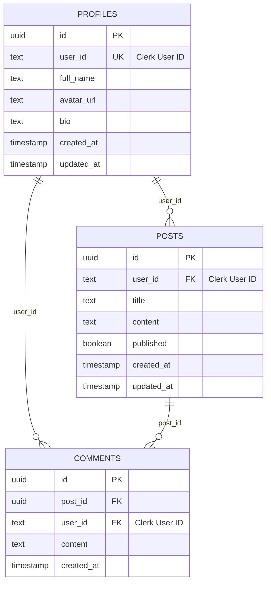

# Migrações de Banco de Dados

Este guia detalha o sistema de migrações do projeto, incluindo as correções aplicadas e as melhores práticas para desenvolvimento com Supabase.

## 📁 Estrutura das Migrações

As migrações estão organizadas no diretório `supabase/migrations/` em ordem cronológica:

```
supabase/migrations/
├── 20240617000001_initial_setup.sql         # ✅ Configuração inicial otimizada
├── 20240617000002_create_profiles_table.sql # ✅ Tabela de perfis de usuário  
├── 20240617000003_create_posts_table.sql    # ✅ Sistema de posts corrigido
├── 20240617000004_create_comments_table.sql # ✅ Sistema de comentários
├── 20240617000005_realtime_setup.sql        # ✅ Configuração Realtime otimizada
└── 20240617000006_fix_clerk_rls_policies.sql # ✅ Políticas RLS melhoradas
```

## 🔧 Correções Aplicadas

### ❌ Problemas Identificados e Corrigidos

#### 1. **Migration 001 - Initial Setup**
**Problemas encontrados:**
- Tentativa de criar schemas já existentes no Supabase (`auth`, `storage`, `_realtime`)
- Criação desnecessária da tabela `auth.users` (já existe)
- Funções `auth.uid()` e `auth.jwt()` customizadas desnecessárias

**✅ Solução aplicada:**
```sql
-- Removido: CREATE SCHEMA IF NOT EXISTS auth;
-- Removido: CREATE SCHEMA IF NOT EXISTS storage;
-- Removido: CREATE SCHEMA IF NOT EXISTS _realtime;
-- Removido: CREATE TABLE IF NOT EXISTS auth.users

-- Mantido apenas o essencial:
CREATE EXTENSION IF NOT EXISTS "uuid-ossp";
CREATE EXTENSION IF NOT EXISTS "pgcrypto";

CREATE OR REPLACE FUNCTION update_updated_at_column()
RETURNS TRIGGER AS $$
BEGIN
  NEW.updated_at = TIMEZONE('utc'::text, NOW());
  RETURN NEW;
END;
$$ language 'plpgsql';
```

#### 2. **Migration 003 - Posts Table**
**Problema:** Erro de sintaxe em `NOW')` (faltava parêntese)

**✅ Correção:**
```sql
-- ❌ Antes: NOW') NOT NULL
-- ✅ Depois: NOW()) NOT NULL
updated_at TIMESTAMP WITH TIME ZONE DEFAULT TIMEZONE('utc'::text, NOW()) NOT NULL
```

#### 3. **Migration 005 - Realtime Setup**
**Problemas:**
- Tentativa de criar publication `supabase_realtime` já existente
- Criação do schema `realtime` desnecessária

**✅ Solução:**
```sql
-- Removido: CREATE PUBLICATION supabase_realtime;
-- Removido: CREATE SCHEMA IF NOT EXISTS realtime;

-- Mantido apenas:
ALTER PUBLICATION supabase_realtime ADD TABLE public.profiles;
ALTER PUBLICATION supabase_realtime ADD TABLE public.posts;
ALTER PUBLICATION supabase_realtime ADD TABLE public.comments;
```

#### 4. **Migration 006 - RLS Policies (Nova)**
**Melhoria:** Criação de função helper para melhor integração com Clerk

**✅ Nova funcionalidade:**
```sql
-- Função helper para extrair user_id do JWT do Clerk
CREATE OR REPLACE FUNCTION get_clerk_user_id() 
RETURNS TEXT AS $$
BEGIN
  RETURN COALESCE(
    current_setting('request.jwt.claim.sub', true),
    (current_setting('request.jwt.claims', true)::jsonb ->> 'sub')
  );
END;
$$ LANGUAGE plpgsql SECURITY DEFINER;

-- Políticas RLS simplificadas usando a função helper
CREATE POLICY "Users can view own profile" ON public.profiles
  FOR SELECT USING (user_id = get_clerk_user_id());
```

## 📊 Schema Final do Banco

### Tabelas Criadas

| Tabela | Propósito | Campos Principais | RLS Habilitado |
|--------|-----------|-------------------|----------------|
| `profiles` | Perfis de usuário | `id`, `user_id`, `full_name`, `avatar_url`, `bio` | ✅ |
| `posts` | Conteúdo do usuário | `id`, `user_id`, `title`, `content`, `published` | ✅ |
| `comments` | Comentários em posts | `id`, `post_id`, `user_id`, `content` | ✅ |

### Relacionamentos



### Índices Criados

**Performance otimizada com índices estratégicos:**

```sql
-- Profiles
CREATE INDEX IF NOT EXISTS idx_profiles_user_id ON public.profiles(user_id);
CREATE INDEX IF NOT EXISTS idx_profiles_created_at ON public.profiles(created_at DESC);

-- Posts
CREATE INDEX IF NOT EXISTS idx_posts_user_id ON public.posts(user_id);
CREATE INDEX IF NOT EXISTS idx_posts_published ON public.posts(published);
CREATE INDEX IF NOT EXISTS idx_posts_created_at ON public.posts(created_at DESC);
CREATE INDEX IF NOT EXISTS idx_posts_title ON public.posts(title);

-- Comments
CREATE INDEX IF NOT EXISTS idx_comments_post_id ON public.comments(post_id);
CREATE INDEX IF NOT EXISTS idx_comments_user_id ON public.comments(user_id);
CREATE INDEX IF NOT EXISTS idx_comments_created_at ON public.comments(created_at DESC);
```

## 🔐 Row Level Security (RLS)

### Função Helper Centralizada

Todas as políticas RLS usam uma função helper para melhor manutenibilidade:

```sql
CREATE OR REPLACE FUNCTION get_clerk_user_id() 
RETURNS TEXT AS $$
BEGIN
  RETURN COALESCE(
    current_setting('request.jwt.claim.sub', true),
    (current_setting('request.jwt.claims', true)::jsonb ->> 'sub')
  );
END;
$$ LANGUAGE plpgsql SECURITY DEFINER;
```

### Políticas Implementadas

#### **Profiles Table**
```sql
-- Visualização
CREATE POLICY "Users can view own profile" ON public.profiles
  FOR SELECT USING (user_id = get_clerk_user_id());

-- Atualização
CREATE POLICY "Users can update own profile" ON public.profiles
  FOR UPDATE USING (user_id = get_clerk_user_id());

-- Inserção
CREATE POLICY "Users can insert own profile" ON public.profiles
  FOR INSERT WITH CHECK (user_id = get_clerk_user_id());

-- Exclusão
CREATE POLICY "Users can delete own profile" ON public.profiles
  FOR DELETE USING (user_id = get_clerk_user_id());
```

#### **Posts Table**
```sql
-- Posts públicos para todos
CREATE POLICY "Anyone can view published posts" ON public.posts
  FOR SELECT USING (published = true);

-- Gestão completa dos próprios posts
CREATE POLICY "Users can view own posts" ON public.posts
  FOR SELECT USING (user_id = get_clerk_user_id());

CREATE POLICY "Users can create posts" ON public.posts
  FOR INSERT WITH CHECK (user_id = get_clerk_user_id());

CREATE POLICY "Users can update own posts" ON public.posts
  FOR UPDATE USING (user_id = get_clerk_user_id());

CREATE POLICY "Users can delete own posts" ON public.posts
  FOR DELETE USING (user_id = get_clerk_user_id());
```

#### **Comments Table**
```sql
-- Visualização de comentários em posts públicos
CREATE POLICY "View comments on published posts" ON public.comments
  FOR SELECT USING (
    EXISTS (
      SELECT 1 FROM public.posts 
      WHERE posts.id = comments.post_id 
      AND posts.published = true
    )
  );

-- Comentários próprios
CREATE POLICY "Users can view own comments" ON public.comments
  FOR SELECT USING (user_id = get_clerk_user_id());

-- Gestão de comentários próprios
CREATE POLICY "Users can update own comments" ON public.comments
  FOR UPDATE USING (user_id = get_clerk_user_id());

CREATE POLICY "Users can delete own comments" ON public.comments
  FOR DELETE USING (user_id = get_clerk_user_id());

-- Criar comentários em posts públicos
CREATE POLICY "Create comments on published posts" ON public.comments
  FOR INSERT WITH CHECK (
    EXISTS (
      SELECT 1 FROM public.posts 
      WHERE posts.id = comments.post_id 
      AND posts.published = true
    ) AND
    user_id = get_clerk_user_id()
  );
```

## ⚡ Realtime Configuration

### Tables Enabled for Realtime

```sql
-- Todas as tabelas habilitadas para subscriptions em tempo real
ALTER PUBLICATION supabase_realtime ADD TABLE public.profiles;
ALTER PUBLICATION supabase_realtime ADD TABLE public.posts;
ALTER PUBLICATION supabase_realtime ADD TABLE public.comments;
```

### Função de Controle Realtime

```sql
-- Função para controle granular de updates em tempo real
CREATE OR REPLACE FUNCTION realtime.can_update(
  schema_name TEXT,
  table_name TEXT,
  user_id UUID,
  operation TEXT
) RETURNS BOOLEAN AS $$
BEGIN
  -- Permite todos os updates por enquanto
  -- Em produção você pode implementar controle mais granular
  RETURN true;
END;
$$ LANGUAGE plpgsql SECURITY DEFINER;
```

## 🚀 Comandos de Migração

### Desenvolvimento Local

```bash
# 1. Iniciar Supabase local
supabase start

# 2. Aplicar todas as migrações (reset completo)
supabase db reset

# 3. Aplicar apenas novas migrações
supabase migration up

# 4. Verificar status
supabase status

# 5. Ver logs
supabase logs
```

### Produção

```bash
# 1. Conectar ao projeto
supabase link --project-ref seu-project-ref

# 2. Verificar diferenças pendentes
supabase db diff

# 3. Aplicar migrações
supabase db push

# 4. Verificar aplicação
supabase db pull --schema public
```

### Criar Nova Migração

```bash
# Criar arquivo de migração
supabase migration new nome_da_nova_migracao

# Editar o arquivo criado em supabase/migrations/
# Aplicar localmente
supabase db reset

# Aplicar em produção
supabase db push
```

## 🧪 Testando as Migrações

### Verificação Local

1. **Iniciar serviços:**
```bash
supabase start
```

2. **Aplicar migrações:**
```bash
supabase db reset
```

3. **Verificar no Studio:**
- Acesse: http://127.0.0.1:54333
- Navegue para **Table Editor**
- Verifique as tabelas: `profiles`, `posts`, `comments`
- Teste as políticas RLS

4. **Verificar Realtime:**
- Acesse **Database > Replication**
- Confirme que as tabelas estão na publication `supabase_realtime`

### Testes de RLS

```sql
-- Testar se RLS está habilitado
SELECT schemaname, tablename, rowsecurity 
FROM pg_tables 
WHERE schemaname = 'public' 
AND rowsecurity = true;

-- Listar políticas
SELECT schemaname, tablename, policyname, permissive, roles, cmd, qual, with_check
FROM pg_policies 
WHERE schemaname = 'public';

-- Testar função helper
SELECT get_clerk_user_id();
```

### Testes de Performance

```sql
-- Verificar índices criados
SELECT schemaname, tablename, indexname, indexdef
FROM pg_indexes 
WHERE schemaname = 'public'
ORDER BY tablename, indexname;

-- Analisar planos de query
EXPLAIN ANALYZE SELECT * FROM posts WHERE user_id = 'user_123';
EXPLAIN ANALYZE SELECT * FROM posts WHERE published = true ORDER BY created_at DESC;
```

## 🛠️ Troubleshooting

### Problemas Comuns

#### 1. **Erro: "publication supabase_realtime already exists"**
**Causa:** Tentativa de criar publication já existente
**Solução:** Usar apenas `ALTER PUBLICATION supabase_realtime ADD TABLE`

#### 2. **Erro: "schema auth already exists"**
**Causa:** Tentativa de criar schemas do Supabase
**Solução:** Remover comandos `CREATE SCHEMA` das migrações

#### 3. **RLS não funcionando**
**Verificações:**
```sql
-- Verificar se RLS está habilitado
SELECT schemaname, tablename, rowsecurity FROM pg_tables WHERE tablename = 'sua_tabela';

-- Verificar políticas
SELECT * FROM pg_policies WHERE tablename = 'sua_tabela';

-- Verificar JWT
SELECT auth.jwt();
SELECT current_setting('request.jwt.claim.sub', true);
```

#### 4. **Performance lenta**
**Soluções:**
- Verificar se índices foram criados
- Analisar queries com `EXPLAIN ANALYZE`
- Otimizar políticas RLS
- Considerar usar `SECURITY DEFINER` functions

### Logs Úteis

```bash
# Ver logs do Supabase local
supabase logs

# Ver logs específicos
supabase logs -f postgres
supabase logs -f realtime
supabase logs -f kong

# Debug de migrations
supabase db reset --debug
```

## 📋 Checklist de Migração

### ✅ Antes de Aplicar

- [ ] Migração testada localmente
- [ ] RLS habilitado em todas as tabelas públicas
- [ ] Políticas RLS definidas e testadas
- [ ] Índices criados para performance
- [ ] Função `get_clerk_user_id()` implementada
- [ ] Realtime configurado se necessário
- [ ] Backup do banco em produção

### ✅ Após Aplicar

- [ ] Tabelas criadas corretamente
- [ ] RLS funcionando
- [ ] Políticas testadas com usuários reais
- [ ] Realtime funcionando
- [ ] Performance aceitável
- [ ] Logs sem erros

### ✅ Rollback Plan

Em caso de problemas:

```bash
# 1. Identificar migração problemática
supabase db diff

# 2. Reverter para estado anterior
# (implementar migration de rollback)

# 3. Aplicar correções
supabase migration new fix_problema

# 4. Testar e reaplicar
supabase db reset
```

## 🎯 Melhores Práticas

### 1. **Nomenclatura**
- Use prefixo timestamp: `YYYYMMDDHHMMSS_`
- Nomes descritivos: `create_table_name` ou `add_index_performance`
- Sem espaços ou caracteres especiais

### 2. **Estrutura da Migração**
```sql
-- Sempre começar com comentário descritivo
-- Migration: Create user profiles table
-- Description: Adds user profile information linked to Clerk

-- Usar IF NOT EXISTS para idempotência
CREATE TABLE IF NOT EXISTS public.profiles (
  -- definição da tabela
);

-- Habilitar RLS
ALTER TABLE public.profiles ENABLE ROW LEVEL SECURITY;

-- Criar políticas
CREATE POLICY "policy_name" ON public.profiles
  FOR SELECT USING (condition);

-- Criar índices
CREATE INDEX IF NOT EXISTS idx_name ON public.profiles(column);
```

### 3. **Testes**
- Sempre testar localmente primeiro
- Usar `supabase db reset` para teste completo
- Verificar RLS com usuários diferentes
- Testar performance com dados similares à produção

### 4. **Versionamento**
- Uma migração por funcionalidade
- Nunca editar migrações já aplicadas em produção
- Criar nova migração para correções

## 📚 Recursos Adicionais

### Documentação
- [Supabase Migrations](https://supabase.com/docs/guides/cli/local-development#database-migrations)
- [PostgreSQL DDL](https://www.postgresql.org/docs/current/ddl.html)
- [Row Level Security](https://supabase.com/docs/guides/auth/row-level-security)

### Exemplos no Projeto
- `supabase/migrations/` - Todas as migrações implementadas
- `src/lib/supabase/` - Configuração do cliente
- `docs/05-features/supabase-integration.md` - Guia de integração completo

### Comandos de Referência

```bash
# Supabase CLI
supabase --help
supabase migration --help
supabase db --help

# PostgreSQL úteis
\dt public.*              # Listar tabelas
\d+ table_name           # Descrever tabela
\dp                      # Listar privilégios
SELECT * FROM pg_policies; # Listar políticas RLS
``` 