# Diagramas Mermaid da Aplicação

## 📋 Visão Geral

Este documento contém todos os diagramas Mermaid da aplicação organizados por categoria. Estes diagramas ajudam a visualizar a arquitetura, fluxos e relacionamentos entre os componentes da aplicação.

## 🏗️ Arquitetura da Aplicação

### Diagrama de Arquitetura Geral
```mermaid
graph TB
    subgraph "Frontend - Next.js 15"
        A[App Router] --> B[Páginas]
        A --> C[Componentes]
        A --> D[Hooks]
        
        B --> B1[Dashboard]
        B --> B2[Auth]
        B --> B3[Profile]
        B --> B4[Tables]
        
        C --> C1[UI Components]
        C --> C2[Layout Components]
        C --> C3[Chart Components]
        C --> C4[Form Components]
    end
    
    subgraph "Styling & Theme"
        E[Tailwind CSS]
        F[next-themes]
        G[CSS Variables]
    end
    
    subgraph "Internacionalização"
        H[next-intl]
        I[Messages PT-BR]
        J[Messages EN]
    end
    
    subgraph "Autenticação"
        K[Clerk Provider]
        L[Auth Guard]
        M[OAuth Providers]
    end
    
    subgraph "Data & Services"
        N[Chart Services]
        O[User Services]
        P[API Client]
    end
    
    A --> E
    A --> H
    A --> K
    A --> N
    
    style A fill:#3b82f6,stroke:#1e40af,color:#fff
    style K fill:#10b981,stroke:#059669,color:#fff
    style H fill:#f59e0b,stroke:#d97706,color:#fff
    style E fill:#8b5cf6,stroke:#7c3aed,color:#fff
```

### Fluxo de Roteamento
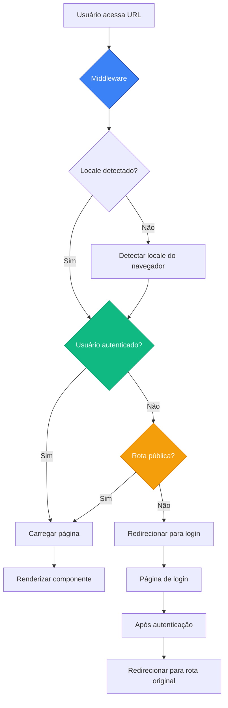

## 🔐 Autenticação

### Fluxo de Autenticação
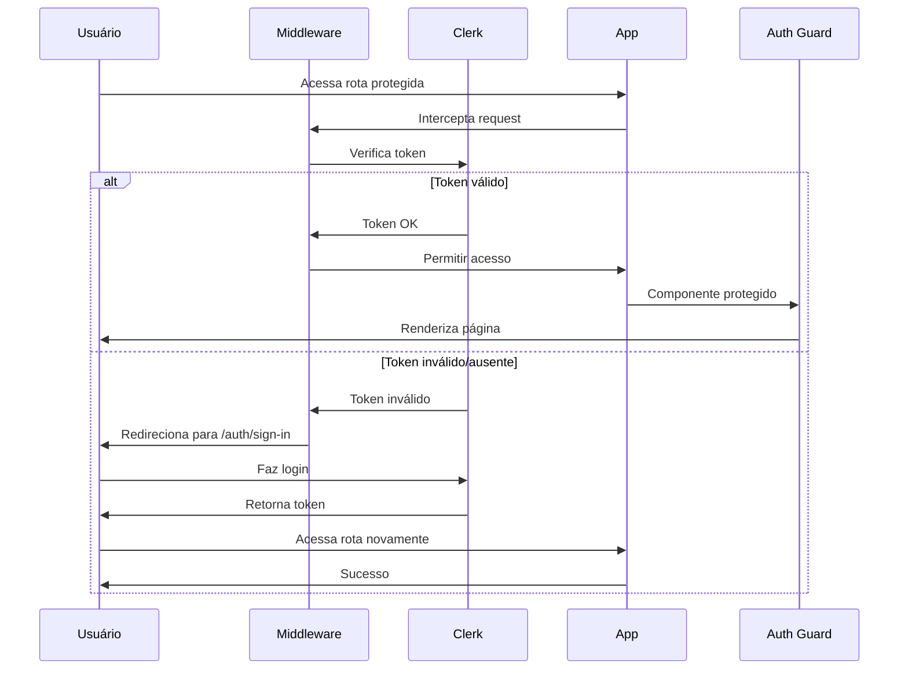

### OAuth Flow
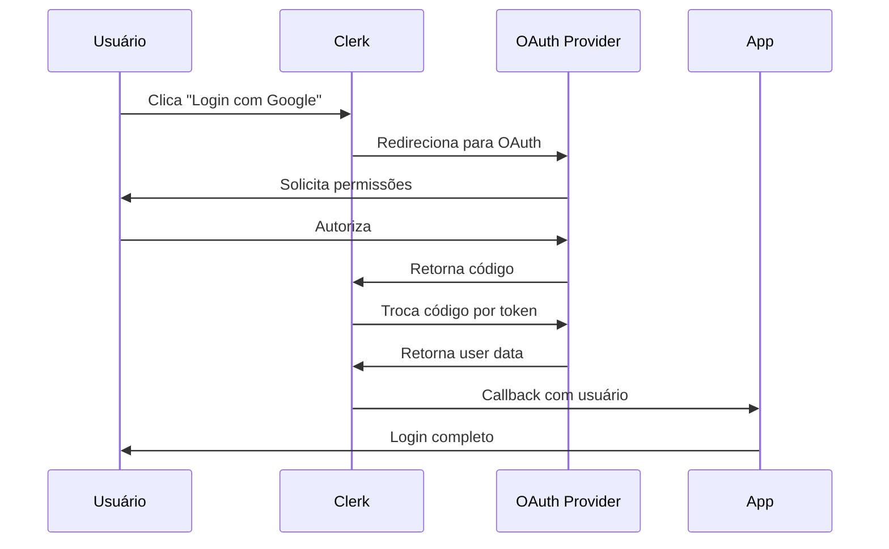

### Diagrama de Proteção de Rotas
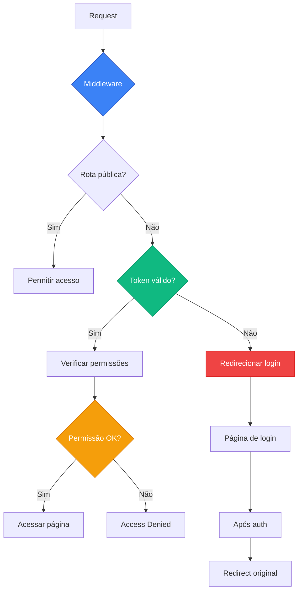

## 🌍 Internacionalização

### Fluxo de Internacionalização
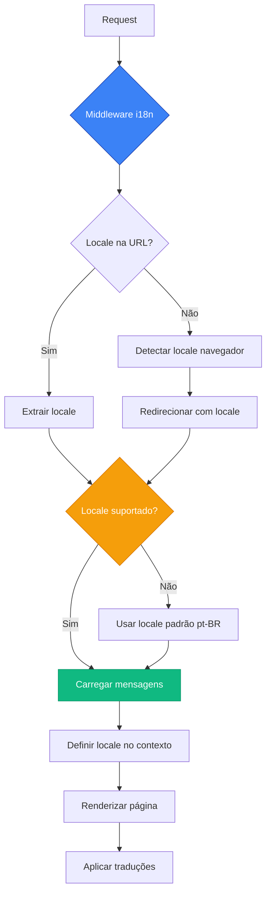

### Estrutura de Mensagens
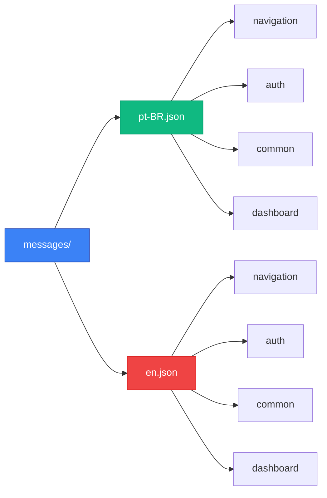

## 🎨 Componentes

### Hierarquia de Componentes
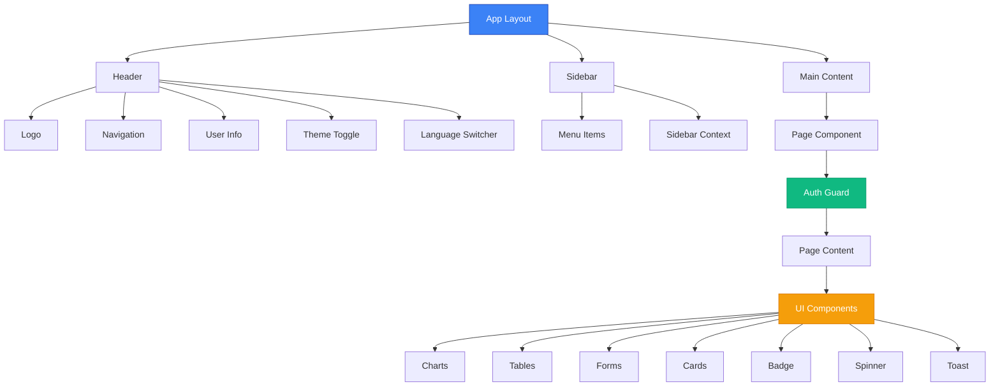

### Arquitetura de Componentes
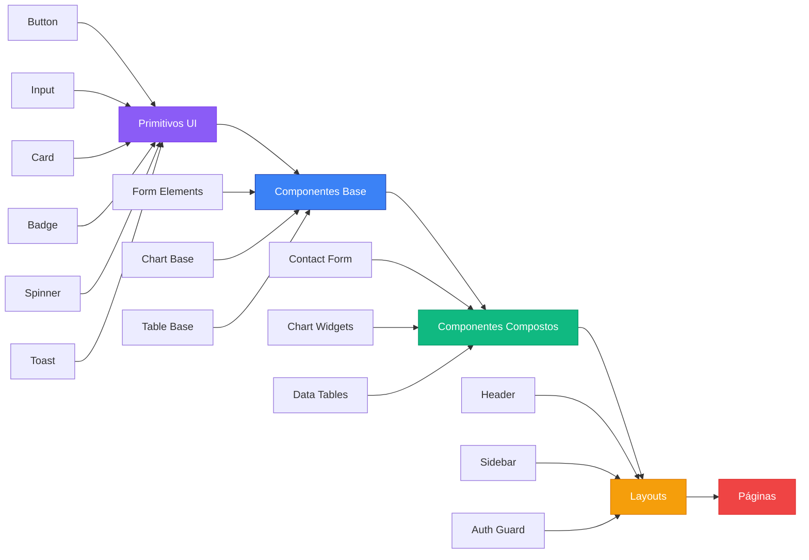

## 📊 Fluxo de Dados

### Fluxo de Data Fetching
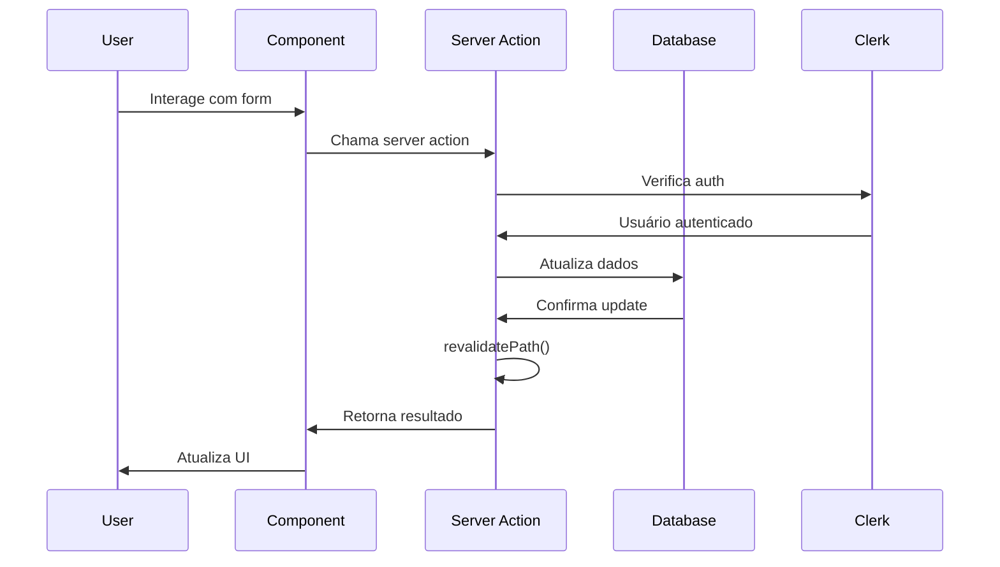

### Data Flow Patterns
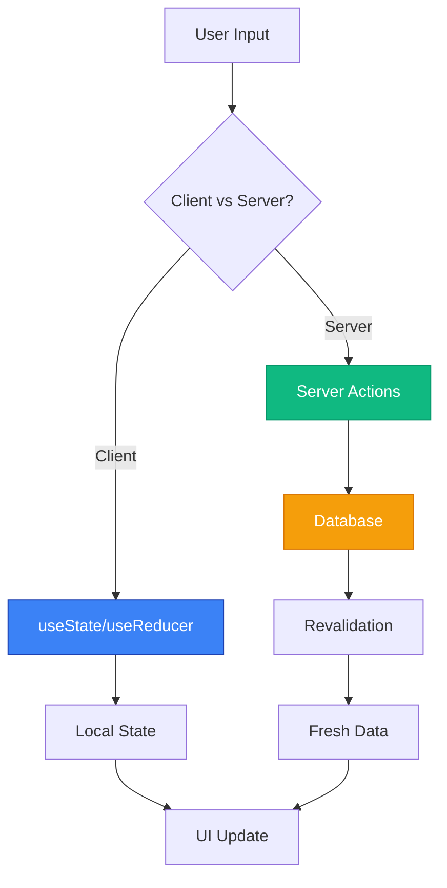

## 🚀 Deploy

### Fluxo de Deploy
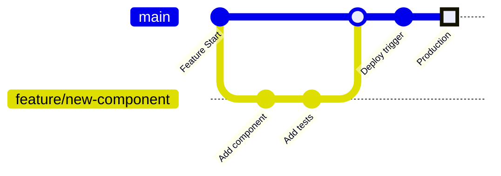

### Pipeline de CI/CD
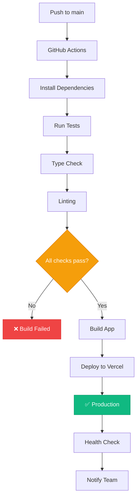

## 📱 User Journey

### Jornada do Usuário
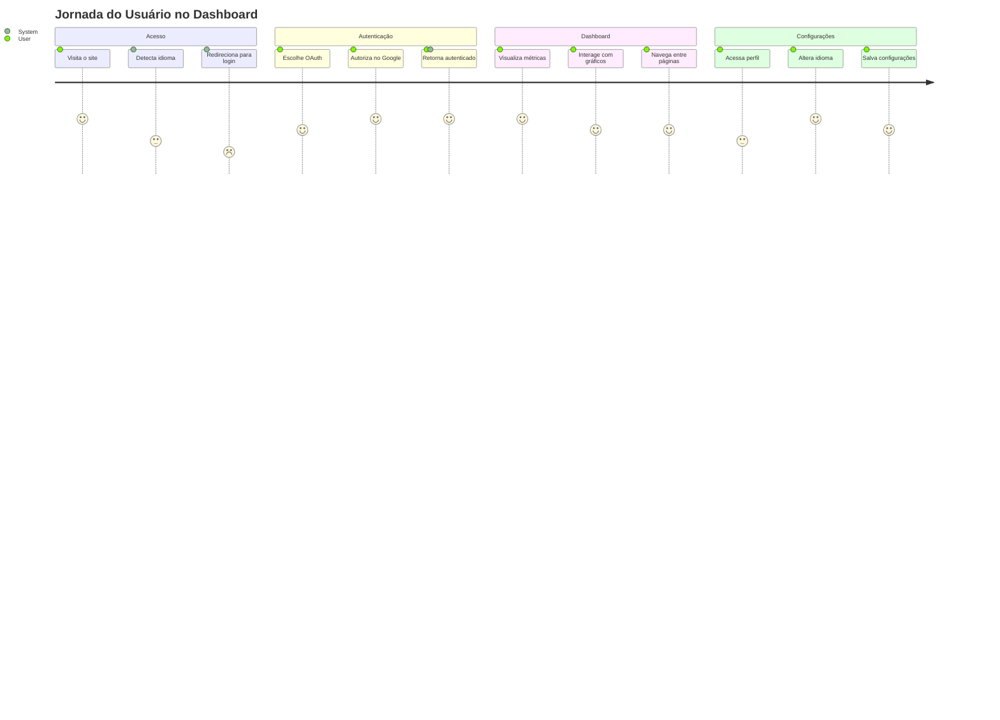

### Estados da Aplicação
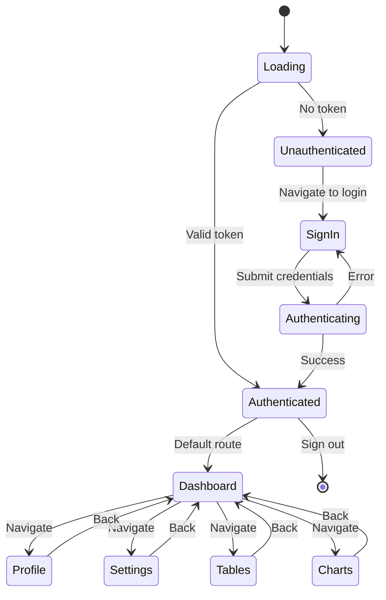

## 🔄 Lifecycle Diagrams

### Component Lifecycle
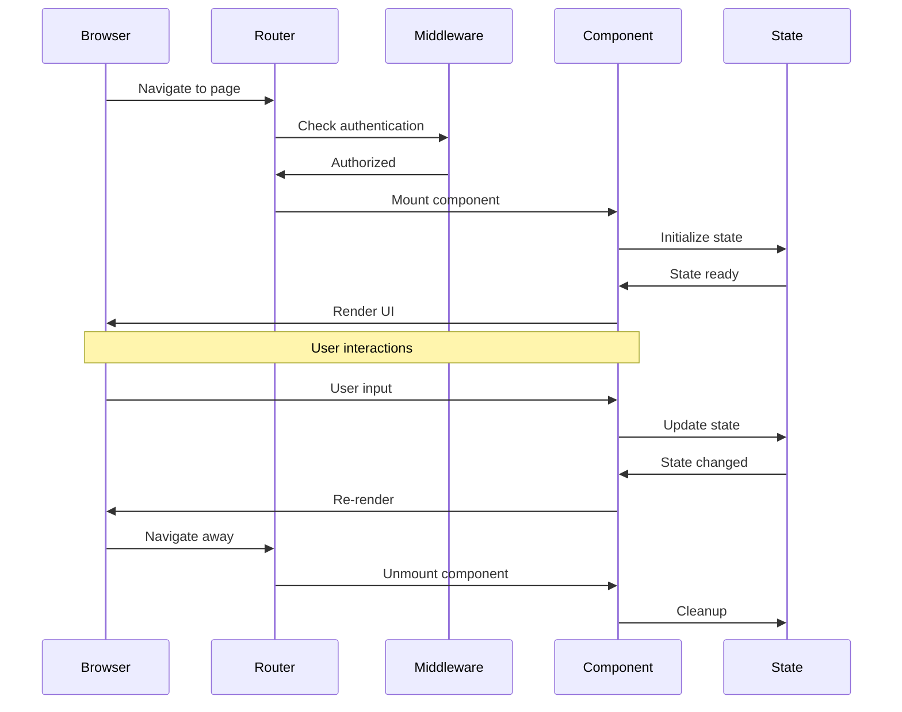

### Theme Switch Flow
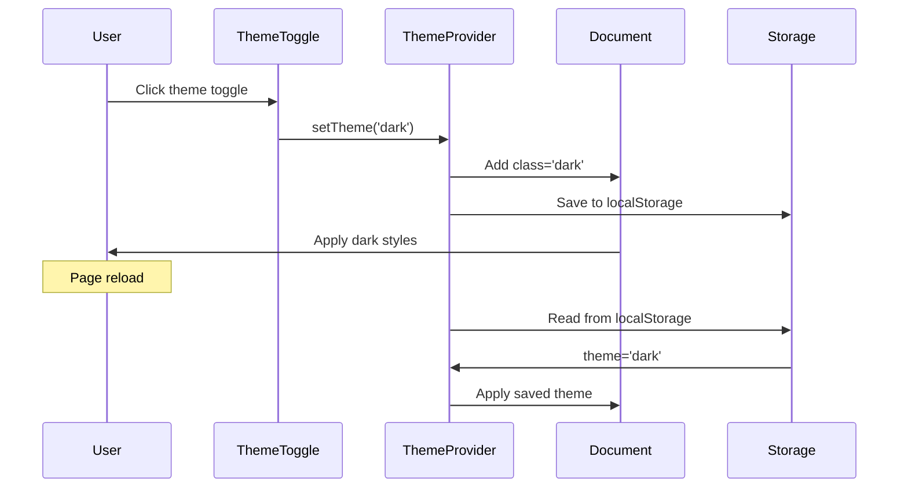

## 📋 Como Usar os Diagramas

### Visualização
- **GitHub/GitLab**: Os diagramas são renderizados automaticamente
- **VSCode**: Use a extensão "Mermaid Preview"
- **Online**: Cole o código no [Mermaid Live Editor](https://mermaid.live/)

### Edição
1. Copie o código do diagrama
2. Cole no editor Mermaid
3. Edite conforme necessário
4. Atualize a documentação

### Sintaxe Mermaid
- **Flowchart**: `flowchart TD` ou `graph TD`
- **Sequence**: `sequenceDiagram`
- **GitGraph**: `gitGraph`
- **Journey**: `journey`
- **State**: `stateDiagram-v2`

### Cores Personalizadas
```
style NodeId fill:#3b82f6,stroke:#1e40af,color:#fff
```
- **Azul**: `#3b82f6` (Primary)
- **Verde**: `#10b981` (Success)
- **Amarelo**: `#f59e0b` (Warning)
- **Vermelho**: `#ef4444` (Error)
- **Roxo**: `#8b5cf6` (Secondary)