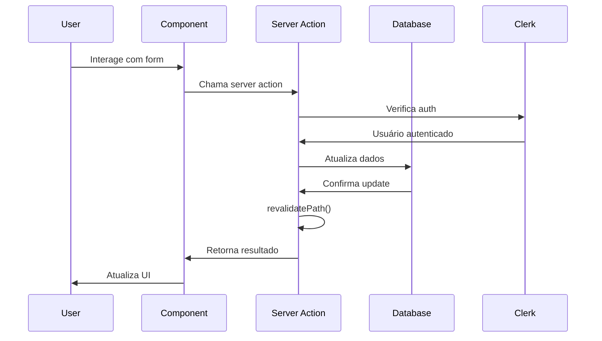
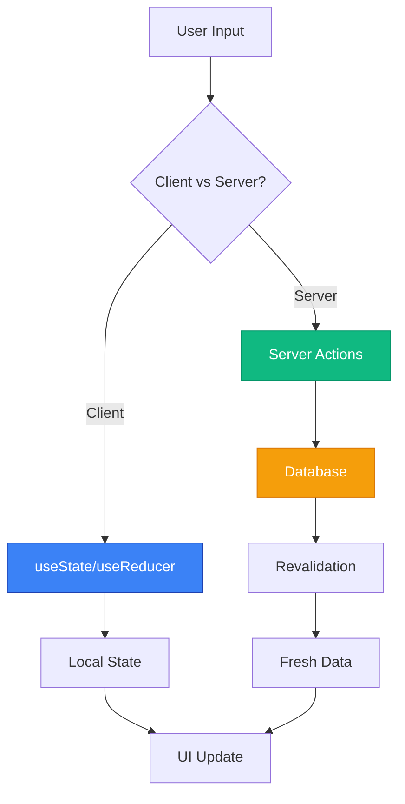

# Guia de Desenvolvimento

## 📋 Visão Geral

Este guia apresenta as melhores práticas, padrões de código e fluxos de desenvolvimento para a aplicação AI Coders Starter Kit. Seguir estas diretrizes garantirá consistência, qualidade e manutenibilidade do código.

## 🚀 Configuração do Ambiente

### Pré-requisitos
- **Node.js**: 18.17.0 ou superior
- **npm**: 9.0.0 ou superior (ou Yarn/pnpm)
- **Git**: Para controle de versão
- **VSCode**: Editor recomendado

### Configuração Inicial
```bash
# Clone o repositório
git clone <repository-url>

# Entre no diretório
cd nextjs-admin-dashboard

# Instale as dependências
npm install

# Configure as variáveis de ambiente
cp .env.example .env.local

# Configure o Clerk (veja CLERK_SETUP.md)

# Inicie o servidor de desenvolvimento
npm run dev
```

### Extensões VSCode Recomendadas
```json
// .vscode/extensions.json
{
  "recommendations": [
    "esbenp.prettier-vscode",
    "bradlc.vscode-tailwindcss",
    "ms-vscode.vscode-typescript-next",
    "streetsidesoftware.code-spell-checker",
    "ms-vscode.vscode-json"
  ]
}
```

## 🏗️ Nova Arquitetura: Landing + App

### Separação de Contextos
A aplicação agora utiliza uma arquitetura que separa claramente dois contextos:

#### 🏠 Landing Page (Marketing)
- **Localização**: `/src/app/[locale]/page.tsx`
- **Componentes**: `/src/app/[locale]/_components/`
- **Propósito**: Apresentar o produto, conversão de visitantes
- **Layout**: Navbar + Footer (sem sidebar)
- **Público**: Usuários não autenticados

#### 📱 Aplicação (Dashboard)
- **Localização**: `/src/app/[locale]/app/`
- **Layout**: `/src/app/[locale]/app/layout.tsx` (AuthGuard + Sidebar)
- **Propósito**: Funcionalidades do produto
- **Layout**: Sidebar + Header + Content
- **Público**: Usuários autenticados

### Vantagens da Nova Estrutura
1. **SEO Otimizado**: Landing page específica para marketing
2. **Performance**: Carregamento otimizado por contexto
3. **Manutenibilidade**: Separação clara de responsabilidades
4. **Escalabilidade**: Evolução independente de cada área
5. **UX**: Experiência personalizada por tipo de usuário

### Fluxo de Roteamento
```
/ (landing) → /auth/sign-up → /app/dashboard
             ↓
           /auth/sign-in → /app/dashboard
```

## 📁 Estrutura de Projeto

### Organização de Pastas
```
src/
├── app/                    # App Router (Next.js 15)
│   ├── [locale]/          # Rotas internacionalizadas
│   └── globals.css        # Estilos globais
├── components/            # Componentes reutilizáveis
│   ├── ui/               # Componentes base/primitivos
│   ├── Layouts/          # Componentes de layout
│   └── [Feature]/        # Componentes por funcionalidade
├── hooks/                # Custom hooks
├── lib/                  # Utilitários e configurações
├── types/                # Definições de tipos TypeScript
├── utils/                # Funções utilitárias
└── services/             # Serviços e APIs
```

### Convenções de Nomenclatura
- **Componentes**: PascalCase (`MyComponent.tsx`)
- **Hooks**: camelCase com prefixo `use` (`useMyHook.ts`)
- **Utilitários**: camelCase (`formatDate.ts`)
- **Tipos**: PascalCase (`UserData.ts`)
- **Constantes**: UPPER_SNAKE_CASE (`API_ENDPOINTS`)

## 🔧 Padrões de Código

### Componentes React

#### Estrutura Básica
```typescript
// components/ui/button.tsx
import { ComponentProps, forwardRef } from 'react';
import { cva, type VariantProps } from 'class-variance-authority';
import { cn } from '@/lib/utils';

const buttonVariants = cva(
  "inline-flex items-center justify-center rounded-md text-sm font-medium transition-colors focus-visible:outline-none focus-visible:ring-2 focus-visible:ring-ring disabled:pointer-events-none disabled:opacity-50",
  {
    variants: {
      variant: {
        default: "bg-primary text-primary-foreground hover:bg-primary/90",
        outline: "border border-input bg-background hover:bg-accent",
      },
      size: {
        default: "h-10 px-4 py-2",
        sm: "h-9 rounded-md px-3",
        lg: "h-11 rounded-md px-8",
      },
    },
    defaultVariants: {
      variant: "default",
      size: "default",
    },
  }
);

export interface ButtonProps
  extends ComponentProps<"button">,
    VariantProps<typeof buttonVariants> {}

export const Button = forwardRef<HTMLButtonElement, ButtonProps>(
  ({ className, variant, size, ...props }, ref) => {
    return (
      <button
        className={cn(buttonVariants({ variant, size, className }))}
        ref={ref}
        {...props}
      />
    );
  }
);

Button.displayName = "Button";
```

#### Server Components
```typescript
// app/[locale]/dashboard/page.tsx
import { getTranslations } from 'next-intl/server';
import { OverviewCards } from './_components/overview-cards';

interface DashboardPageProps {
  params: {
    locale: string;
  };
}

export default async function DashboardPage({ params }: DashboardPageProps) {
  const t = await getTranslations('dashboard');

  return (
    <div className="container mx-auto py-6">
      <h1 className="text-3xl font-bold mb-6">{t('title')}</h1>
      <OverviewCards />
    </div>
  );
}

export async function generateMetadata({ params }: DashboardPageProps) {
  const t = await getTranslations('metadata');
  
  return {
    title: t('dashboard.title'),
    description: t('dashboard.description'),
  };
}
```

#### Client Components
```typescript
// components/theme-toggle.tsx
'use client';

import { useTheme } from 'next-themes';
import { useEffect, useState } from 'react';
import { Button } from '@/components/ui/Button';

export function ThemeToggle() {
  const [mounted, setMounted] = useState(false);
  const { theme, setTheme } = useTheme();

  useEffect(() => {
    setMounted(true);
  }, []);

  if (!mounted) {
    return null;
  }

  const toggleTheme = () => {
    setTheme(theme === 'dark' ? 'light' : 'dark');
  };

  return (
    <Button
      variant="outline"
      size="icon"
      onClick={toggleTheme}
    >
      {theme === 'dark' ? '🌞' : '🌙'}
    </Button>
  );
}
```

### Custom Hooks

#### Estrutura Básica
```typescript
// hooks/use-local-storage.ts
import { useState, useEffect } from 'react';

export function useLocalStorage<T>(
  key: string,
  initialValue: T
): [T, (value: T | ((val: T) => T)) => void] {
  const [storedValue, setStoredValue] = useState<T>(() => {
    if (typeof window === "undefined") {
      return initialValue;
    }
    try {
      const item = window.localStorage.getItem(key);
      return item ? JSON.parse(item) : initialValue;
    } catch (error) {
      console.error(`Error reading localStorage key "${key}":`, error);
      return initialValue;
    }
  });

  const setValue = (value: T | ((val: T) => T)) => {
    try {
      const valueToStore = value instanceof Function ? value(storedValue) : value;
      setStoredValue(valueToStore);
      if (typeof window !== "undefined") {
        window.localStorage.setItem(key, JSON.stringify(valueToStore));
      }
    } catch (error) {
      console.error(`Error setting localStorage key "${key}":`, error);
    }
  };

  return [storedValue, setValue];
}
```

### Tipos TypeScript

#### Definições de Interface
```typescript
// types/user.ts
export interface User {
  id: string;
  email: string;
  name: string;
  avatar?: string;
  role: UserRole;
  createdAt: Date;
  updatedAt: Date;
}

export type UserRole = 'admin' | 'user' | 'moderator';

export interface CreateUserData {
  email: string;
  name: string;
  role?: UserRole;
}

export interface UpdateUserData extends Partial<CreateUserData> {
  id: string;
}
```

#### Props e Component Types
```typescript
// types/component-props.ts
import { ReactNode } from 'react';

export interface BaseComponentProps {
  children?: ReactNode;
  className?: string;
}

export interface PageProps {
  params: {
    locale: string;
  };
  searchParams?: {
    [key: string]: string | string[] | undefined;
  };
}

export type SetStateAction<T> = T | ((prevState: T) => T);
```

## 🎨 Styling Guidelines

### Tailwind CSS Best Practices
```typescript
// ✅ Bom - Classes organizadas e legíveis
<div className="flex items-center justify-between p-4 bg-white dark:bg-gray-800 border border-gray-200 dark:border-gray-700 rounded-lg shadow-sm">

// ✅ Bom - Usando utilitário cn() para conditional classes
<button 
  className={cn(
    "px-4 py-2 rounded-md font-medium transition-colors",
    variant === 'primary' && "bg-blue-600 text-white hover:bg-blue-700",
    variant === 'secondary' && "bg-gray-200 text-gray-900 hover:bg-gray-300",
    disabled && "opacity-50 cursor-not-allowed"
  )}
>

// ❌ Evitar - Classes muito longas em uma linha
<div className="flex items-center justify-between p-4 bg-white dark:bg-gray-800 border border-gray-200 dark:border-gray-700 rounded-lg shadow-sm hover:shadow-md transition-shadow duration-200">
```

### CSS Custom Properties
```css
/* ✅ Bom - Usando CSS variables para consistência */
.component {
  background-color: hsl(var(--background));
  color: hsl(var(--foreground));
  border-color: hsl(var(--border));
}

/* ❌ Evitar - Cores hardcoded */
.component {
  background-color: #ffffff;
  color: #000000;
  border-color: #e5e7eb;
}
```

## 🌍 Internacionalização

### Uso de Traduções
```typescript
// ✅ Bom - Namespace organizado
const t = useTranslations('dashboard.overview');
<h2>{t('title')}</h2>
<p>{t('description')}</p>

// ✅ Bom - Interpolação de valores
const t = useTranslations('common');
<p>{t('welcome', { name: user.name })}</p>

// ❌ Evitar - Texto hardcoded
<h2>Dashboard Overview</h2>
<p>Welcome to your dashboard</p>
```

### Estrutura de Mensagens
```json
{
  "dashboard": {
    "overview": {
      "title": "Visão Geral",
      "description": "Acompanhe suas métricas principais"
    },
    "stats": {
      "totalUsers": "Total de Usuários",
      "revenue": "Receita",
      "growth": "Crescimento"
    }
  }
}
```

## 🔐 Autenticação e Segurança

### Proteção de Rotas
```typescript
// ✅ Bom - Usando AuthGuard
export default function ProtectedPage() {
  return (
    <AuthGuard>
      <DashboardContent />
    </AuthGuard>
  );
}

// ✅ Bom - Verificação de permissões
const { user } = useUser();

if (!user || user.role !== 'admin') {
  return <AccessDenied />;
}
```

### Handling de Dados Sensíveis
```typescript
// ✅ Bom - Nunca expor dados sensíveis
const publicUserData = {
  id: user.id,
  name: user.name,
  avatar: user.avatar,
  // Não incluir: email, senha, tokens
};

// ❌ Evitar - Expor dados completos do usuário
console.log(user); // Pode conter dados sensíveis
```

## 📊 Estado e Data Fetching

### Fluxo de Data Fetching


### Data Flow Patterns


### Server Actions (Recomendado)
```typescript
// actions/user-actions.ts
'use server';

import { auth } from '@clerk/nextjs/server';
import { revalidatePath } from 'next/cache';

export async function updateUserProfile(formData: FormData) {
  const { userId } = auth();
  
  if (!userId) {
    throw new Error('Unauthorized');
  }

  const name = formData.get('name') as string;
  
  // Update user in database
  await updateUser(userId, { name });
  
  revalidatePath('/profile');
  
  return { success: true };
}
```

### Client-side State
```typescript
// ✅ Bom - Estado local para UI
const [isOpen, setIsOpen] = useState(false);
const [formData, setFormData] = useState(initialData);

// ✅ Bom - Custom hook para lógica complexa
const { data, loading, error, refetch } = useUserData(userId);
```

## 🧪 Testing Guidelines

### Estrutura de Testes
```typescript
// __tests__/components/button.test.tsx
import { render, screen, fireEvent } from '@testing-library/react';
import { Button } from '@/components/ui/Button';

describe('Button Component', () => {
  it('renders with correct text', () => {
    render(<Button>Click me</Button>);
    expect(screen.getByRole('button')).toHaveTextContent('Click me');
  });

  it('calls onClick handler when clicked', () => {
    const handleClick = jest.fn();
    render(<Button onClick={handleClick}>Click me</Button>);
    
    fireEvent.click(screen.getByRole('button'));
    expect(handleClick).toHaveBeenCalledTimes(1);
  });

  it('applies correct variant classes', () => {
    render(<Button variant="outline">Outline Button</Button>);
    expect(screen.getByRole('button')).toHaveClass('border');
  });
});
```

## 🚀 Performance

### Code Splitting
```typescript
// ✅ Bom - Dynamic imports para componentes pesados
import dynamic from 'next/dynamic';

const HeavyChart = dynamic(
  () => import('./components/heavy-chart'),
  { 
    loading: () => <ChartSkeleton />,
    ssr: false 
  }
);
```

### Image Optimization
```typescript
// ✅ Bom - Usando Next.js Image
import Image from 'next/image';

<Image
  src="/images/hero.jpg"
  alt="Hero image"
  width={800}
  height={600}
  priority={true}
  placeholder="blur"
  blurDataURL="data:image/jpeg;base64,..."
/>
```

## 🐛 Error Handling

### Error Boundaries
```typescript
// components/error-boundary.tsx
'use client';

import { Component, ReactNode } from 'react';

interface Props {
  children: ReactNode;
  fallback?: ReactNode;
}

interface State {
  hasError: boolean;
}

export class ErrorBoundary extends Component<Props, State> {
  constructor(props: Props) {
    super(props);
    this.state = { hasError: false };
  }

  static getDerivedStateFromError(): State {
    return { hasError: true };
  }

  componentDidCatch(error: Error, errorInfo: any) {
    console.error('Error caught by boundary:', error, errorInfo);
  }

  render() {
    if (this.state.hasError) {
      return this.props.fallback || <h2>Something went wrong.</h2>;
    }

    return this.props.children;
  }
}
```

### Async Error Handling
```typescript
// ✅ Bom - Try-catch com loading states
const [loading, setLoading] = useState(false);
const [error, setError] = useState<string | null>(null);

const handleSubmit = async (data: FormData) => {
  setLoading(true);
  setError(null);
  
  try {
    await submitForm(data);
    // Success handling
  } catch (err) {
    setError(err instanceof Error ? err.message : 'Unknown error');
  } finally {
    setLoading(false);
  }
};
```

## 📚 Git Workflow

### Commit Messages
```bash
# ✅ Bom - Mensagens descritivas
feat(auth): add OAuth login with Google
fix(sidebar): resolve mobile navigation toggle
docs(readme): update installation instructions
refactor(components): extract common button logic

# ❌ Evitar - Mensagens vagas
git commit -m "fix bug"
git commit -m "update code"
```

### Branch Naming
```bash
# ✅ Bom - Nomes descritivos
feature/oauth-integration
bugfix/sidebar-mobile-toggle
hotfix/critical-auth-issue
refactor/button-components
```

## 🔍 Code Review Checklist

### Antes de Submeter PR
- [ ] Código segue os padrões estabelecidos
- [ ] Componentes são reutilizáveis e bem documentados
- [ ] Tipos TypeScript estão corretos
- [ ] Tradução foi adicionada para novos textos
- [ ] Testes foram escritos/atualizados
- [ ] Performance foi considerada
- [ ] Acessibilidade foi verificada
- [ ] Responsividade foi testada

### Durante Code Review
- [ ] Lógica está clara e bem estruturada
- [ ] Nomes de variáveis/funções são descritivos
- [ ] Não há código duplicado
- [ ] Error handling está implementado
- [ ] Segurança foi considerada
- [ ] Documentação foi atualizada se necessário

## 🎨 Padrões de Componentes UI

### Criação de Novos Componentes

#### Estrutura Padrão com CVA
```typescript
// src/components/ui/component-name.tsx
import { cva, type VariantProps } from "class-variance-authority";
import { cn } from "@/lib/utils";
import * as React from "react";

const componentVariants = cva(
  "base-classes-here",
  {
    variants: {
      variant: {
        default: "default-classes",
        primary: "primary-classes",
        success: "success-classes",
        // ... more variants
      },
      size: {
        sm: "small-classes",
        md: "medium-classes", 
        lg: "large-classes",
      },
    },
    defaultVariants: {
      variant: "default",
      size: "md",
    },
  }
);

export interface ComponentProps
  extends React.HTMLAttributes<HTMLDivElement>,
    VariantProps<typeof componentVariants> {
  // Additional props specific to component
}

function Component({
  className,
  variant,
  size,
  ...props
}: ComponentProps) {
  return (
    <div
      className={cn(componentVariants({ variant, size, className }))}
      {...props}
    />
  );
}

export { Component, componentVariants };
```

#### Exemplos de Componentes Implementados

**Badge Component** (`src/components/ui/badge.tsx`)
- 6 variantes de cor (default, primary, success, warning, error, info)
- 3 tamanhos (sm, md, lg)
- Suporte a ícones e badges removíveis
- Badge de notificação (dot)

```typescript
<Badge>Novo</Badge>
<Badge variant="success">Aprovado</Badge>
<Badge removable onRemove={handleRemove}>Tag</Badge>
<Badge icon={<CheckIcon />} variant="success">Verificado</Badge>
```

**Spinner Component** (`src/components/ui/spinner.tsx`)
- 5 variantes visuais (ring, dots, pulse, bars, bounce)
- 5 tamanhos (xs, sm, md, lg, xl)
- 6 cores disponíveis
- LoadingOverlay para páginas inteiras

```typescript
<Spinner />
<Spinner variant="dots" size="lg" />
<LoadingOverlay isLoading={loading}>
  <div>Conteúdo</div>
</LoadingOverlay>
```

**Toast Component** (Hook: `src/hooks/use-toast.ts`)
- Sistema baseado em Sonner
- 5 tipos (success, error, warning, info, loading)
- Suporte a promises e ações
- Auto-dismiss configurável

```typescript
const { toast, success, error, loading } = useToast();

success("Operação realizada!");
toast({
  title: "Email enviado",
  description: "Sucesso ao enviar",
  action: { label: "Ver", onClick: handleView }
});
```

### Checklist para Novos Componentes UI

#### Implementação Técnica
- [ ] Usar CVA para variants
- [ ] Interface TypeScript extends React.HTMLAttributes
- [ ] Suporte automático a dark/light mode
- [ ] Classes Tailwind responsivas
- [ ] Prop forwarding com `{...props}`
- [ ] Export do componente e variants

#### Documentação
- [ ] Adicionar ao `docs/componentes.md`
- [ ] Criar página de demonstração em `/ui-elements/[name]`
- [ ] Adicionar traduções (pt-BR e en)
- [ ] Atualizar `UI_ELEMENTS` list
- [ ] Exemplo de uso na documentação

#### Integração
- [ ] Testar com tema dark/light
- [ ] Verificar responsividade
- [ ] Validar acessibilidade
- [ ] Testar com diferentes locales
- [ ] Performance check (bundle size)

### Dependências para Componentes UI

**Essenciais:**
- `class-variance-authority` - Para variants
- `clsx` / `tailwind-merge` - Para classes condicionais
- `lucide-react` - Para ícones

**Específicas:**
- `sonner` - Para toast notifications
- `@radix-ui/*` - Para componentes complexos (Dialog, Select, etc.)

### Padrões de Naming

**Arquivos:**
- `kebab-case.tsx` para componentes
- `use-kebab-case.ts` para hooks

**Componentes:**
- `PascalCase` para componentes
- `camelCase` para props
- `SCREAMING_SNAKE_CASE` para constantes

**CSS:**
- Usar classes Tailwind sempre que possível
- Criar CSS customizado apenas quando necessário
- Manter consistência com o design system