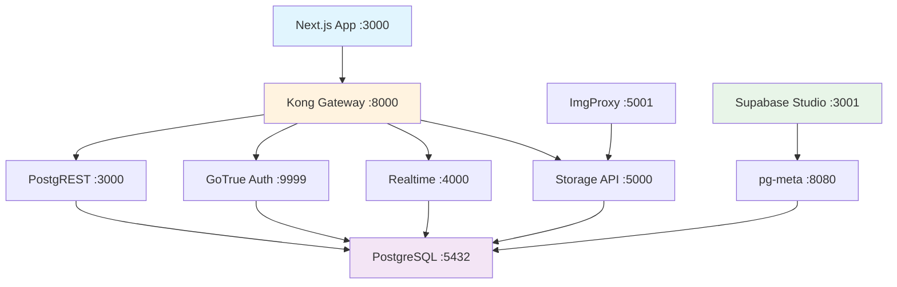

# Simulação Local do Supabase

Este guia explica como funciona a simulação completa do Supabase em ambiente local usando Docker, permitindo desenvolvimento offline e testes completos.

## 🏗️ Arquitetura Local

### Visão Geral dos Serviços

O setup local simula toda a stack do Supabase através de containers Docker:



### Componentes e Funções

| Serviço | Porta | Função | Equivale ao Supabase |
|---------|-------|---------|---------------------|
| **Kong Gateway** | 8000 | API Gateway, roteamento, auth | API Gateway oficial |
| **PostgreSQL** | 5432 | Banco de dados principal | Banco PostgreSQL |
| **PostgREST** | 3000 | API REST automática | REST API |
| **GoTrue** | 9999 | Autenticação e usuários | Auth API |
| **Realtime** | 4000 | WebSockets e subscriptions | Realtime API |
| **Storage** | 5000 | Upload e storage de arquivos | Storage API |
| **Studio** | 3001 | Interface de administração | Supabase Dashboard |
| **pg-meta** | 8080 | Metadados do banco | API de metadados |
| **ImgProxy** | 5001 | Transformação de imagens | Image Transformation |

## 🚪 Como Funciona o Kong Gateway

### Papel do Kong

Kong atua como **ponto único de entrada**, exatamente como na produção:

```
Sua App → Kong (:8000) → Serviços internos
```

### Roteamento Inteligente

Kong roteia requisições baseado no path:

```yaml
# Configuração em supabase/kong.yml
/rest/v1/*     → PostgREST   (CRUD automático)
/auth/v1/*     → GoTrue      (Login/signup)
/realtime/v1/* → Realtime    (WebSockets)
/storage/v1/*  → Storage     (Arquivos)
```

### Exemplo de Fluxo

1. **Sua app faz**: `fetch('http://localhost:8000/rest/v1/posts')`
2. **Kong recebe** e verifica o JWT token
3. **Kong roteia** para PostgREST na porta 3000
4. **PostgREST** executa query no PostgreSQL
5. **Resposta** volta através do Kong

## 🔐 Autenticação Local

### JWT Tokens

O ambiente local usa tokens JWT pré-configurados:

```javascript
// Token anon (público)
const ANON_KEY = "eyJhbGciOiJIUzI1NiIsInR5cCI6IkpXVCJ9..."

// Token service_role (admin)
const SERVICE_KEY = "eyJhbGciOiJIUzI1NiIsInR5cCI6IkpXVCJ9..."
```

### Integração com Clerk

Quando usando Clerk + Supabase local:

```typescript
// No cliente, o token Clerk é injetado automaticamente
const clerkToken = await getToken({ template: 'supabase' });

// Kong valida o token Clerk usando as políticas RLS
```

## 📊 PostgreSQL e Row Level Security

### Configuração do Banco

O PostgreSQL local tem:

```sql
-- Schemas criados automaticamente
CREATE SCHEMA auth;     -- Para GoTrue
CREATE SCHEMA storage;  -- Para Storage
CREATE SCHEMA realtime; -- Para Realtime
CREATE SCHEMA public;   -- Para suas tabelas
```

### RLS com Clerk

As políticas RLS funcionam com tokens Clerk:

```sql
-- Política que funciona com JWT do Clerk
CREATE POLICY "users_own_data" ON posts
  FOR SELECT USING (
    auth.jwt() ->> 'sub' = user_id
  );
```

### Funções de Auth

Funções helper para RLS:

```sql
-- Pega o user ID do JWT
SELECT auth.jwt() ->> 'sub';

-- Pega claims específicos
SELECT auth.jwt() ->> 'email';
```

## 🔄 Realtime Local

### Como Funciona

O serviço Realtime local:

1. **Monitora** mudanças no PostgreSQL via WAL (Write-Ahead Log)
2. **Filtra** baseado em políticas RLS
3. **Envia** via WebSocket para clientes conectados

### Configuração

```sql
-- Habilitar realtime para uma tabela
ALTER PUBLICATION supabase_realtime ADD TABLE posts;
```

### No Cliente

```typescript
// Subscription funciona igual à produção
const subscription = supabase
  .channel('posts')
  .on('postgres_changes', {
    event: '*',
    schema: 'public',
    table: 'posts'
  }, (payload) => {
    console.log('Mudança em tempo real:', payload);
  })
  .subscribe();
```

## 💾 Storage Local

### Armazenamento

Arquivos são salvos em volume Docker:

```yaml
volumes:
  - storage_data:/var/lib/storage
```

### Transformação de Imagens

ImgProxy processa imagens automaticamente:

```typescript
// URL para imagem redimensionada
const imageUrl = `${supabaseUrl}/storage/v1/render/image/public/avatar.jpg?width=300&height=300`;
```

## 🛠️ Studio Local

### Acesso

Supabase Studio local: http://localhost:3001

### Funcionalidades

- ✅ **Table Editor**: Visualizar e editar dados
- ✅ **SQL Editor**: Executar queries
- ✅ **Auth Manager**: Gerenciar usuários (limitado)
- ✅ **Storage Browser**: Ver arquivos
- ❌ **Functions**: Não disponível localmente
- ❌ **Extensions**: Limitado

## 🔧 Configuração de Desenvolvimento

### Variáveis de Ambiente

Para usar o ambiente local:

```env
# .env.local
NEXT_PUBLIC_SUPABASE_URL=http://localhost:8000
NEXT_PUBLIC_SUPABASE_ANON_KEY=eyJhbGciOiJIUzI1NiIsInR5cCI6IkpXVCJ9...
SUPABASE_SERVICE_ROLE_KEY=eyJhbGciOiJIUzI1NiIsInR5cCI6IkpXVCJ9...
```

### Cliente Supabase

O cliente se conecta ao Kong local:

```typescript
const supabase = createClient(
  'http://localhost:8000',  // Kong Gateway
  'eyJhbGciOiJIUzI1NiIs...' // Anon key
);
```

## 🚀 Comandos de Gerenciamento

### Inicialização

```bash
# Iniciar todos os serviços
npm run db:start

# Apenas PostgreSQL
npm run db:setup
```

### Monitoramento

```bash
# Ver status dos containers
docker-compose ps

# Logs em tempo real
docker-compose logs -f

# Logs específicos
docker-compose logs -f kong
docker-compose logs -f postgres
```

### Reset e Limpeza

```bash
# Parar serviços
npm run db:stop

# Reset completo (apaga dados!)
npm run db:reset
```

## 🔍 Debug e Troubleshooting

### Problemas Comuns

1. **Kong não inicia**:
```bash
# Verificar configuração
docker-compose logs kong
# Conferir supabase/kong.yml
```

2. **Conexão recusada**:
```bash
# Verificar se serviços estão rodando
docker-compose ps
# Aguardar inicialização completa
```

3. **JWT inválido**:
```bash
# Verificar se token está correto
curl -H "Authorization: Bearer TOKEN" http://localhost:8000/rest/v1/posts
```

### Logs Úteis

```bash
# Ver queries SQL
docker-compose logs postgres

# Ver requisições API
docker-compose logs kong

# Ver erros de auth
docker-compose logs auth
```

## 🎯 Vantagens do Setup Local

### Para Desenvolvimento

- ✅ **Offline**: Funciona sem internet
- ✅ **Rápido**: Sem latência de rede
- ✅ **Isolado**: Dados de teste isolados
- ✅ **Reset fácil**: `npm run db:reset`

### Para Testes

- ✅ **Reproduzível**: Ambiente consistente
- ✅ **Completo**: Todos os recursos Supabase
- ✅ **Migrations**: Teste de schema changes
- ✅ **RLS**: Teste de políticas de segurança

### Para Aprendizado

- ✅ **Transparente**: Ver como funciona internamente
- ✅ **Experimentação**: Testar configurações
- ✅ **Debugging**: Logs detalhados

## ⚠️ Limitações

### Funcionalidades Não Disponíveis

- ❌ **Edge Functions**: Precisam de Deno runtime
- ❌ **Webhooks**: Configuração externa necessária
- ❌ **Auth Providers**: Apenas email/password local
- ❌ **CDN**: Sem distribuição global

### Diferenças da Produção

- 🔄 **Performance**: Sem otimizações de produção
- 🔄 **Escalabilidade**: Single-node setup
- 🔄 **Backup**: Sem backup automático
- 🔄 **Monitoring**: Logs básicos apenas

## 🎉 Conclusão

O setup local simula 90% do Supabase real, oferecendo:

- **Desenvolvimento rápido** sem dependências externas
- **Testes completos** de funcionalidades
- **Aprendizado** da arquitetura Supabase
- **Debugging** com controle total

É a forma ideal de desenvolver aplicações Supabase antes do deploy em produção!