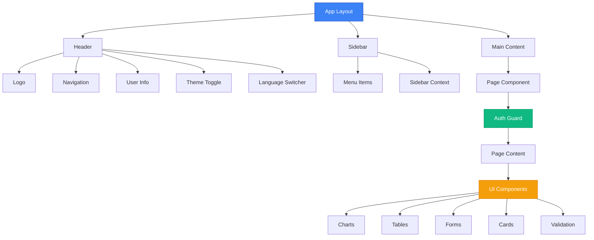
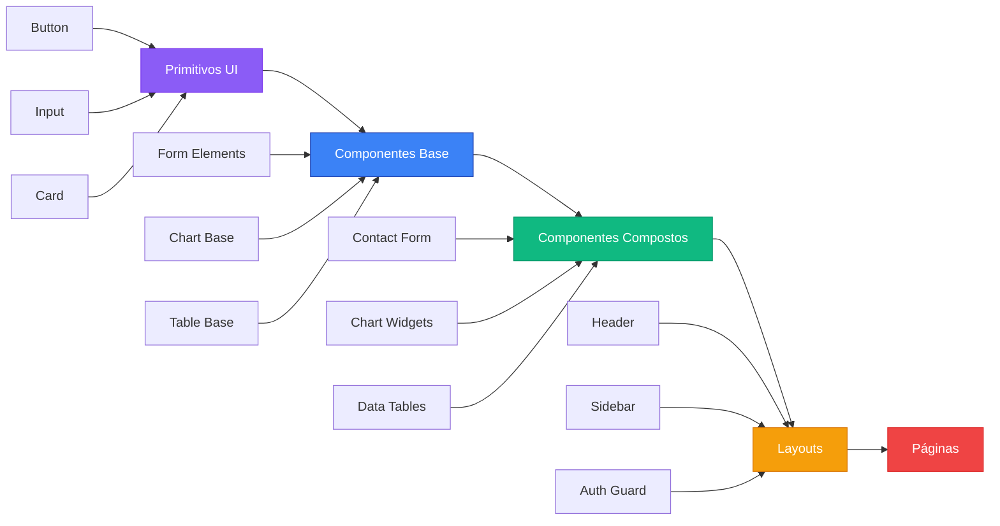

# Componentes da Aplicação

## 📋 Visão Geral

A aplicação possui uma biblioteca rica de componentes organizados por funcionalidade. Todos os componentes são construídos com TypeScript, Tailwind CSS e seguem os padrões de design da aplicação.

## 🏗️ Estrutura de Componentes

### Hierarquia de Componentes


### Arquitetura de Componentes


### Diretório `components/`
```
components/
├── Breadcrumbs/           # Navegação breadcrumb
├── CalenderBox/           # Widget de calendário
├── Charts/                # Componentes de gráficos
├── FormElements/          # Elementos de formulário
├── Layouts/               # Componentes de layout
├── Tables/                # Componentes de tabelas
├── ui-elements/           # Elementos base de UI
├── ui/                    # Componentes primitivos
│   ├── badge.tsx          # Badge component
│   ├── spinner.tsx        # Spinner component
│   ├── dropdown.tsx       # Dropdown menu
│   ├── skeleton.tsx       # Loading skeleton
│   └── table.tsx          # Table base
├── auth-guard.tsx         # Proteção de rotas
├── language-switcher.tsx  # Seletor de idioma
├── logo.tsx               # Componente do logo
└── period-picker.tsx      # Seletor de período
```

### Diretório `hooks/`
```
hooks/
├── use-click-outside.ts   # Hook para cliques externos
├── use-mobile.ts          # Hook para detecção mobile
├── use-toast.ts           # Hook para toast notifications
└── useNavigation.ts       # Hook para navegação
```

### Diretório `providers/`
```
providers/
└── toast-provider.tsx    # Provider para toast notifications
```

## 🎨 Componentes de Layout

### Header (`Layouts/header/`)
```typescript
// Localização: src/components/Layouts/header/index.tsx
```

**Funcionalidades:**
- Logo da aplicação
- Navegação principal
- Notificações
- Toggle de tema (dark/light)
- Informações do usuário
- Seletor de idioma

**Sub-componentes:**
- `notification/` - Sistema de notificações
- `theme-toggle/` - Switch dark/light mode
- `user-info/` - Menu do usuário

### Sidebar (`Layouts/sidebar/`)
```typescript
// Localização: src/components/Layouts/sidebar/index.tsx
```

**Funcionalidades:**
- Menu de navegação lateral
- Suporte a internacionalização
- Items expansíveis
- Design responsivo
- Estados ativos/inativos

**Arquivos principais:**
- `index.tsx` - Componente principal
- `menu-item.tsx` - Item individual do menu
- `sidebar-context.tsx` - Context para estado
- `hooks/useExpandedItems.ts` - Hook para expansão
- `hooks/useInternationalizedRoutes.ts` - Hook para rotas i18n

## 📊 Componentes de Gráficos

### Charts (`Charts/`)

#### Campaign Visitors
```typescript
// Localização: src/components/Charts/campaign-visitors/
```
- Gráfico de visitantes de campanha
- Integração com ApexCharts
- Dados dinâmicos

#### Payments Overview
```typescript
// Localização: src/components/Charts/payments-overview/
```
- Visão geral de pagamentos
- Gráfico de barras/linhas
- Período customizável

#### Used Devices
```typescript
// Localização: src/components/Charts/used-devices/
```
- Estatísticas de dispositivos
- Gráfico de pizza/donut
- Responsivo

#### Weeks Profit
```typescript
// Localização: src/components/Charts/weeks-profit/
```
- Lucro semanal
- Gráfico de área
- Comparativo de períodos

## 📝 Elementos de Formulário

### FormElements (`FormElements/`)

#### Checkboxes
- `CheckboxOne.tsx` - Checkbox básico
- `CheckboxTwo.tsx` - Checkbox com label
- `CheckboxThree.tsx` - Checkbox customizado
- `CheckboxFour.tsx` - Checkbox com ícone
- `CheckboxFive.tsx` - Checkbox avançado

#### Date Pickers
- `DatePickerOne.tsx` - Seletor de data simples
- `DatePickerTwo.tsx` - Seletor de data com range

#### Input Groups
- `index.tsx` - Input com ícones e labels
- `text-area.tsx` - Área de texto

#### Switchers
- `SwitcherOne.tsx` - Switch básico
- `SwitcherTwo.tsx` - Switch com label
- `SwitcherThree.tsx` - Switch customizado
- `SwitcherFour.tsx` - Switch avançado

#### Outros Elementos
- `MultiSelect.tsx` - Seletor múltiplo
- `checkbox.tsx` - Checkbox base
- `radio.tsx` - Radio button
- `select.tsx` - Select dropdown
- `switch.tsx` - Switch base

## 📋 Componentes de Tabelas

### Tables (`Tables/`)

#### Invoice Table
```typescript
// Localização: src/components/Tables/invoice-table.tsx
```
- Tabela de faturas
- Paginação
- Ordenação
- Filtros

#### Top Channels
```typescript
// Localização: src/components/Tables/top-channels/
```
- Principais canais
- Skeleton loading
- Dados dinâmicos

#### Top Products
```typescript
// Localização: src/components/Tables/top-products/
```
- Produtos principais
- Imagens de produtos
- Estatísticas

## 🎯 Elementos de UI

### ui-elements (`ui-elements/`)

#### Alert
```typescript
// Localização: src/components/ui-elements/alert/
```
- Alertas de sucesso, erro, warning, info
- Ícones customizados
- Dismiss automático

#### Button
```typescript
// Localização: src/components/ui-elements/button.tsx
```
- Múltiplas variantes
- Estados (loading, disabled)
- Tamanhos diferentes

### ui (Primitivos) (`ui/`)

#### Badge
```typescript
// Localização: src/components/ui/badge.tsx
```
**Funcionalidades:**
- 6 variantes de cor (default, primary, success, warning, error, info)
- 3 tamanhos (sm, md, lg)
- Suporte a ícones
- Badge de notificação (dot)
- Badge removível com botão X
- Dark/light mode automático
- CVA (Class Variance Authority) para variants

**Exemplos de uso:**
```typescript
<Badge>Novo</Badge>
<Badge variant="success">Aprovado</Badge>
<Badge size="lg" variant="error">Erro</Badge>
<Badge dot variant="primary">5</Badge>
<Badge removable onRemove={() => handleRemove()}>Tag</Badge>
<Badge icon={<CheckIcon />} variant="success">Verificado</Badge>
```

#### Spinner
```typescript
// Localização: src/components/ui/spinner.tsx
```
**Funcionalidades:**
- 5 variantes visuais (ring, dots, pulse, bars, bounce)
- 5 tamanhos (xs, sm, md, lg, xl)
- 6 cores (primary, white, gray, success, warning, error)
- 3 velocidades (slow, normal, fast)
- Suporte a texto de loading
- LoadingOverlay para páginas inteiras
- Animações CSS otimizadas

**Exemplos de uso:**
```typescript
<Spinner />
<Spinner variant="dots" size="lg" />
<Spinner text="Carregando..." />
<LoadingOverlay isLoading={loading} text="Processando...">
  <div>Conteúdo</div>
</LoadingOverlay>
```

#### Toast
```typescript
// Localização: src/hooks/use-toast.ts + src/providers/toast-provider.tsx
```
**Funcionalidades:**
- 5 tipos (success, error, warning, info, loading)
- Auto-dismiss configurável
- Stack inteligente de múltiplos toasts
- Suporte a ações (botões)
- Promise support com estados automáticos
- Dark/light mode automático
- Posicionamento configurável

**Exemplos de uso:**
```typescript
const { toast, success, error, loading } = useToast();

success("Operação realizada!");
error("Erro ao processar");

toast({
  title: "Email enviado",
  description: "Sucesso ao enviar",
  variant: "success",
  action: {
    label: "Ver",
    onClick: () => console.log("Ver email")
  }
});

loading("Salvando...", fetch('/api/save'));
```

#### Dropdown
```typescript
// Localização: src/components/ui/dropdown.tsx
```
- Menu dropdown base
- Posicionamento automático
- Keyboard navigation

#### Skeleton
```typescript
// Localização: src/components/ui/skeleton.tsx
```
- Loading states
- Animação de shimmer
- Tamanhos variáveis

#### Table
```typescript
// Localização: src/components/ui/table.tsx
```
- Tabela base
- Responsiva
- Estilização consistente

## 🛡️ Componentes de Proteção

### Auth Guard
```typescript
// Localização: src/components/auth-guard.tsx
```
- Proteção de rotas
- Redirecionamento automático
- Loading states

## 🌍 Componentes de Internacionalização

### Language Switcher
```typescript
// Localização: src/components/language-switcher.tsx
```
- Seletor de idioma
- Flags dos países
- Persistência da escolha

## 📅 Componentes Utilitários

### Calendar Box
```typescript
// Localização: src/components/CalenderBox/index.tsx
```
- Widget de calendário
- Navegação de meses
- Eventos destacados

### Period Picker
```typescript
// Localização: src/components/period-picker.tsx
```
- Seletor de período
- Períodos pré-definidos
- Range customizado

### Breadcrumbs
```typescript
// Localização: src/components/Breadcrumbs/Breadcrumb.tsx
```
- Navegação breadcrumb
- Separadores customizados
- Links ativos

### Logo
```typescript
// Localização: src/components/logo.tsx
```
- Logo da aplicação
- Versões dark/light
- Tamanhos responsivos

## 🎨 Padrões de Design

### Convenções de Naming
- **PascalCase** para componentes
- **camelCase** para props e funções
- **kebab-case** para arquivos CSS

### Props Interface
```typescript
interface ComponentProps {
  children?: React.ReactNode;
  className?: string;
  variant?: 'primary' | 'secondary' | 'outline';
  size?: 'sm' | 'md' | 'lg';
  disabled?: boolean;
}
```

### Estrutura de Componente
```typescript
import { ComponentProps } from './types';

export function Component({ 
  children, 
  className, 
  variant = 'primary',
  ...props 
}: ComponentProps) {
  return (
    <div className={cn('base-classes', className)} {...props}>
      {children}
    </div>
  );
}
```

## 🔧 Customização

### Tailwind Classes
Todos os componentes usam classes Tailwind CSS customizáveis:
- **Cores**: Sistema de cores baseado em CSS variables
- **Espaçamento**: Grid system consistente
- **Tipografia**: Fonte Satoshi personalizada

### Tema Dark/Light
Componentes automaticamente se adaptam ao tema escolhido usando:
- `dark:` prefix para modo escuro
- CSS variables para cores dinâmicas
- next-themes para persistência

### Responsividade
Todos os componentes seguem abordagem mobile-first:
- Breakpoints padrão do Tailwind
- Design adaptável
- Touch-friendly em dispositivos móveis

## 📝 Componentes de Validação

### Sistema de Formulários Avançado
A aplicação inclui um sistema robusto de validação construído com **Zod** e **React Hook Form**:

#### Hook useFormValidation
```typescript
const form = useFormValidation<UserFormData>({
  schema: userRegistrationSchema,
  onSubmit: async (data) => { /* ... */ }
});
```

**Funcionalidades:**
- ✅ Type-safe validation com TypeScript
- ✅ Validação em tempo real com debounce
- ✅ Estados de formulário reativos
- ✅ Integração automática com Zod schemas

#### Componente ValidatedInput
```typescript
<ValidatedInput
  name="email"
  label="Email"
  type="email"
  error={error}
  validationState={state}
  showValidationIcon={true}
/>
```

**Estados Visuais:**
- 🔍 Loading durante validação assíncrona
- ✅ Sucesso (borda verde + ícone check)
- ❌ Erro (borda vermelha + mensagem)
- 📝 Modificado (indicador de alteração)

#### Componente FormInput
Wrapper simplificado que conecta automaticamente com o contexto do formulário:

```typescript
<FormInput
  name="email"
  label="Email"
  formContext={form}
  helpText="Digite um email válido"
/>
```

#### Hook useCepLookup
Hook especializado para consulta automática de CEP via API ViaCEP:

```typescript
const cepLookup = useCepLookup({
  onSuccess: (data) => { /* preencher campos */ },
  onError: (error) => { /* tratar erro */ },
  debounceMs: 800
});
```

**Funcionalidades:**
- 🔍 Validação de formato CEP brasileiro
- 📍 Consulta automática via ViaCEP
- ⚡ Cache para evitar consultas repetidas
- 🎯 Debounce configurável
- 📊 Estados de loading/error/success

#### Componente AddressForm
Formulário completo de endereço com consulta automática de CEP:

```typescript
<AddressForm
  title="Endereço de Entrega"
  onSubmit={async (data) => { /* dados validados */ }}
  autoFillFromCep={true}
  defaultValues={{ country: "Brasil" }}
/>
```

**Recursos:**
- 🇧🇷 Preenchimento automático via CEP
- 📱 Layout responsivo
- ✅ Validação completa de todos os campos
- 🎨 Feedback visual de status
- 🧹 Reset fácil do formulário

### Validações Brasileiras Incluídas

#### CPF (Cadastro de Pessoa Física)
- Formato: 000.000.000-00
- Validação completa com dígitos verificadores
- Mensagens de erro em português

#### CNPJ (Cadastro Nacional de Pessoa Jurídica)
- Formato: 00.000.000/0000-00
- Validação completa com dígitos verificadores
- Suporte a formatação automática

#### CEP (Código de Endereçamento Postal)
- Formato: 00000-000
- Consulta automática via API ViaCEP
- Preenchimento automático de endereço

#### Telefone Brasileiro
- Formato: (XX) XXXXX-XXXX
- Suporte a celular e fixo
- Validação de DDD válido

### Schemas Disponíveis

#### Schema de Cadastro de Usuário
```typescript
const userRegistrationSchema = z.object({
  name: z.string().min(2, "Nome muito curto"),
  email: z.string().email("Email inválido"),
  phone: phoneValidation,
  birthDate: z.date().max(new Date(), "Data inválida"),
  password: passwordSchema,
  confirmPassword: z.string(),
  acceptTerms: z.boolean().refine(val => val, "Aceite os termos")
});
```

#### Schema de Endereço
```typescript
const addressSchema = z.object({
  cep: cepValidation,
  street: z.string().min(5, "Logradouro obrigatório"),
  number: z.string().min(1, "Número obrigatório"),
  complement: z.string().optional(),
  neighborhood: z.string().min(2, "Bairro obrigatório"),
  city: z.string().min(2, "Cidade obrigatória"),
  state: z.string().length(2, "Estado inválido"),
  country: z.string().min(2, "País obrigatório")
});
```

### Exemplo de Uso Completo

```typescript
// 1. Definir schema
const contactSchema = z.object({
  name: z.string().min(2, "Nome obrigatório"),
  email: z.string().email("Email inválido"),
  message: z.string().min(10, "Mensagem muito curta")
});

// 2. Usar hook de validação
const form = useFormValidation({
  schema: contactSchema,
  onSubmit: async (data) => {
    await sendMessage(data); // dados já validados
  }
});

// 3. Renderizar formulário
<form onSubmit={form.handleSubmit}>
  <FormInput 
    name="name" 
    label="Nome" 
    formContext={form} 
  />
  <FormInput 
    name="email" 
    label="Email" 
    type="email"
    formContext={form} 
  />
  <FormInput 
    name="message" 
    label="Mensagem" 
    formContext={form} 
  />
  
  <button 
    type="submit" 
    disabled={!form.formState.isValid}
  >
    Enviar
  </button>
</form>
```

Para exemplos completos e funcionais, acesse `/forms/validated-forms` na aplicação.