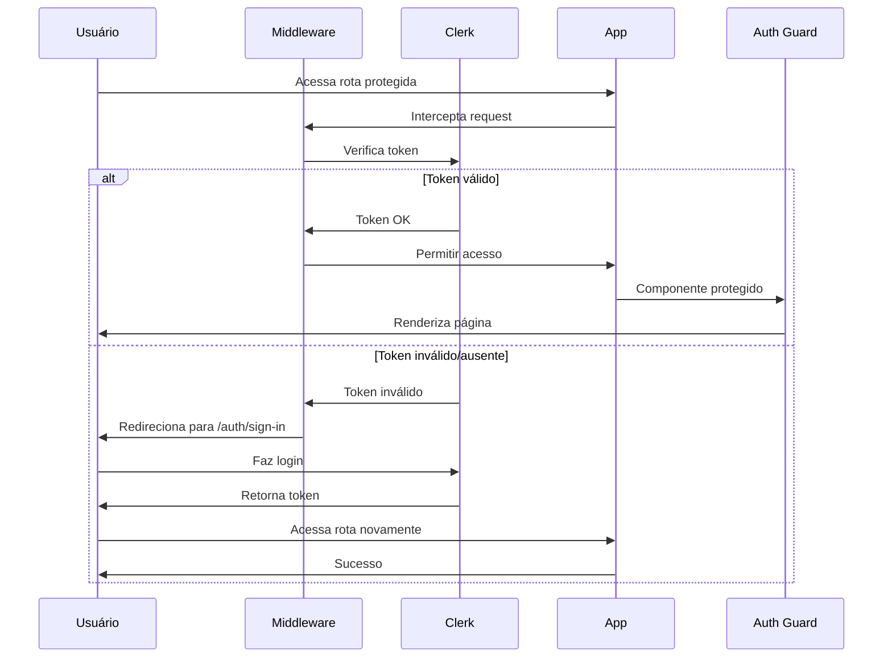
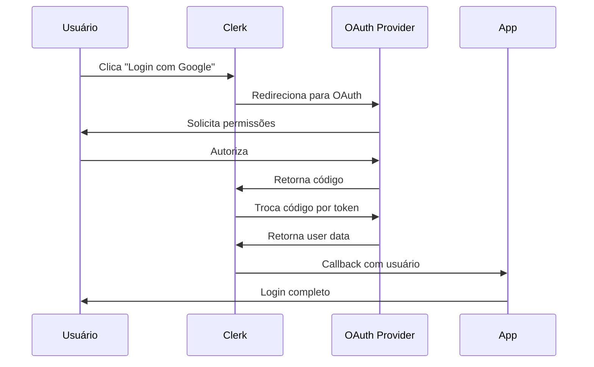
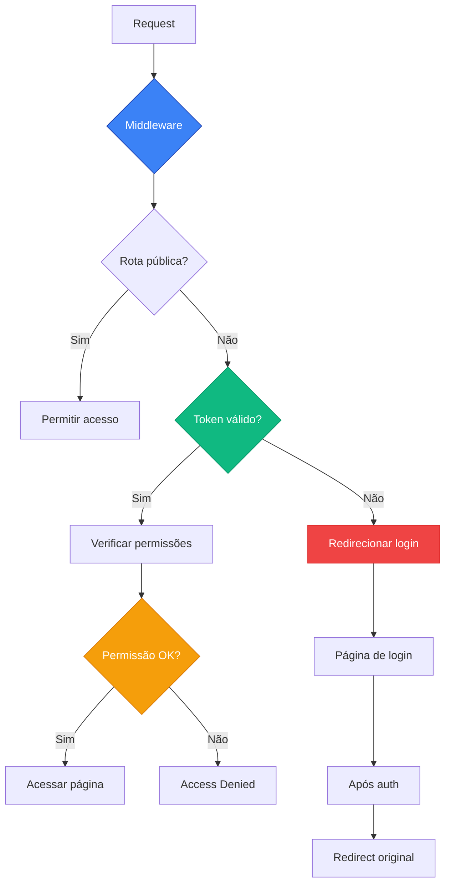

# Sistema de Autenticação

## 📋 Visão Geral

A aplicação utiliza **Clerk** como provedor de autenticação, oferecendo uma solução completa e segura para gerenciamento de usuários, incluindo autenticação tradicional (email/senha) e OAuth com provedores externos.

## 🔐 Clerk Integration

### Fluxo de Autenticação


### OAuth Flow


### Configuração Principal
```typescript
// app/providers.tsx
import { ClerkProvider } from '@clerk/nextjs';

export function Providers({ children }: PropsWithChildren) {
  return (
    <ClerkProvider>
      {/* outros providers */}
      {children}
    </ClerkProvider>
  );
}
```

### Variáveis de Ambiente
```bash
# .env.local
NEXT_PUBLIC_CLERK_PUBLISHABLE_KEY=pk_test_...
CLERK_SECRET_KEY=sk_test_...
NEXT_PUBLIC_CLERK_SIGN_IN_URL=/auth/sign-in
NEXT_PUBLIC_CLERK_SIGN_UP_URL=/auth/sign-up
NEXT_PUBLIC_CLERK_AFTER_SIGN_IN_URL=/
NEXT_PUBLIC_CLERK_AFTER_SIGN_UP_URL=/
```

## 📄 Páginas de Autenticação

### Sign In (Login)
```
Rota: /auth/sign-in
Arquivo: app/[locale]/auth/sign-in/page.tsx
```

**Funcionalidades:**
- Login com email e senha
- OAuth com provedores externos
- "Lembrar-me" checkbox
- Link para cadastro
- Redirecionamento após login

#### SSO Callback
```
Rota: /auth/sign-in/sso-callback
Arquivo: app/[locale]/auth/sign-in/sso-callback/page.tsx
```
- Processamento de retorno OAuth
- Tratamento de erros de autenticação
- Redirecionamento automático

### Sign Up (Cadastro)
```
Rota: /auth/sign-up
Arquivo: app/[locale]/auth/sign-up/page.tsx
```

**Funcionalidades:**
- Cadastro com email e senha
- Validação de dados em tempo real
- Verificação de email
- OAuth para cadastro rápido
- Termos de uso e políticas

#### SSO Callback
```
Rota: /auth/sign-up/sso-callback
Arquivo: app/[locale]/auth/sign-up/sso-callback/page.tsx
```
- Finalização do cadastro via OAuth
- Coleta de informações adicionais
- Configuração inicial do perfil

## 🛡️ Proteção de Rotas

### Diagrama de Proteção


### Middleware de Autenticação
```typescript
// middleware.ts
import { clerkMiddleware, createRouteMatcher } from '@clerk/nextjs/server';

const isPublicRoute = createRouteMatcher([
  '/',
  '/auth(.*)',
  '/pt-BR/auth(.*)',
  '/en/auth(.*)'
]);

export default clerkMiddleware((auth, req) => {
  if (!isPublicRoute(req)) auth().protect();
});
```

### Auth Guard Component
```typescript
// components/auth-guard.tsx
'use client';

import { useAuth } from '@clerk/nextjs';
import { useRouter } from 'next/navigation';

export function AuthGuard({ children }: { children: React.ReactNode }) {
  const { isLoaded, userId } = useAuth();
  const router = useRouter();

  if (!isLoaded) return <LoadingSpinner />;
  
  if (!userId) {
    router.push('/auth/sign-in');
    return null;
  }

  return <>{children}</>;
}
```

### Rotas Públicas
- `/auth/sign-in` - Página de login
- `/auth/sign-up` - Página de cadastro
- `/auth/*/sso-callback` - Callbacks OAuth

### Rotas Protegidas
- `/` - Dashboard principal
- `/profile` - Perfil do usuário
- `/calendar` - Calendário
- `/charts/*` - Páginas de gráficos
- `/forms/*` - Páginas de formulários
- `/tables` - Tabelas
- `/ui-elements/*` - Elementos de UI
- `/settings` - Configurações

## 👤 Gerenciamento de Usuário

### User Info Component
```typescript
// components/Layouts/header/user-info/index.tsx
```

**Funcionalidades:**
- Avatar do usuário
- Menu dropdown com opções
- Link para perfil
- Botão de logout
- Configurações rápidas

### Hooks do Clerk
```typescript
import { 
  useAuth, 
  useUser, 
  useClerk 
} from '@clerk/nextjs';

// Informações de autenticação
const { isLoaded, userId, sessionId } = useAuth();

// Dados do usuário
const { isLoaded, isSignedIn, user } = useUser();

// Métodos do Clerk
const { signOut, openSignIn } = useClerk();
```

## 🔗 OAuth Providers

### Provedores Suportados
- **Google** - Login com conta Google
- **GitHub** - Login com conta GitHub
- **Facebook** - Login com conta Facebook
- **Discord** - Login com conta Discord
- **Microsoft** - Login com conta Microsoft

### Configuração OAuth
```typescript
// Configurado no dashboard do Clerk
// URLs de callback automáticas:
// - https://seu-dominio.com/auth/sso-callback
// - https://seu-dominio.com/auth/sign-in/sso-callback
// - https://seu-dominio.com/auth/sign-up/sso-callback
```

## 📱 Componentes de Autenticação

### Sign In Form
```typescript
// app/[locale]/forms/form-layout/_components/sign-in-form.tsx
```
- Formulário customizado de login
- Validação client-side
- Estados de loading
- Tratamento de erros

### Sign Up Form
```typescript
// app/[locale]/forms/form-layout/_components/sign-up-form.tsx
```
- Formulário customizado de cadastro
- Validação de senha forte
- Confirmação de email
- Termos e condições

## 🔒 Segurança

### Proteções Implementadas
- **CSRF Protection** - Proteção contra ataques CSRF
- **Rate Limiting** - Limitação de tentativas de login
- **Session Management** - Gerenciamento seguro de sessões
- **Password Policies** - Políticas de senha forte
- **Email Verification** - Verificação obrigatória de email

### Headers de Segurança
```typescript
// next.config.mjs
const securityHeaders = [
  {
    key: 'X-DNS-Prefetch-Control',
    value: 'on'
  },
  {
    key: 'Strict-Transport-Security',
    value: 'max-age=63072000; includeSubDomains; preload'
  }
];
```

## 🌍 Internacionalização da Autenticação

### Locales Suportados
- **pt-BR**: Interface em português
- **en**: Interface em inglês

### Configuração de Locale
```typescript
// Clerk detecta automaticamente o locale
// Baseado na configuração do navegador
// Pode ser sobrescrito via parâmetros
```

## 📊 Analytics e Monitoramento

### Eventos Rastreados
- **sign_in_success** - Login bem-sucedido
- **sign_up_success** - Cadastro bem-sucedido
- **sign_out** - Logout do usuário
- **oauth_connection** - Conexão OAuth
- **email_verification** - Verificação de email

### Dashboard do Clerk
- Métricas de usuários ativos
- Taxa de conversão de cadastro
- Análise de provedores OAuth
- Logs de segurança

## 🔧 Customização

### Tema da Autenticação
```typescript
// Clerk suporta customização completa
// Cores, logos, layouts podem ser configurados
// Via dashboard ou programaticamente
```

### Campos Personalizados
```typescript
// Campos adicionais no perfil
interface UserMetadata {
  company?: string;
  role?: string;
  preferences?: UserPreferences;
}
```

## 🛠️ Desenvolvimento e Debug

### Modo de Desenvolvimento
```bash
# Variáveis para desenvolvimento
NEXT_PUBLIC_CLERK_PUBLISHABLE_KEY=pk_test_...
CLERK_SECRET_KEY=sk_test_...
```

### Logs e Debug
```typescript
// Habilitar logs do Clerk
process.env.CLERK_LOGGING = 'true';
```

### Webhooks
```typescript
// Configuração de webhooks para eventos
// POST /api/webhooks/clerk
// Eventos: user.created, user.updated, session.created
```

## 📚 Recursos Adicionais

### Documentação Oficial
- [Clerk Documentation](https://clerk.com/docs)
- [Next.js Integration](https://clerk.com/docs/nextjs)

### Setup Guide
Consulte o arquivo `CLERK_SETUP.md` na raiz do projeto para configuração detalhada do Clerk.

### Troubleshooting
- Verifique as variáveis de ambiente
- Confirme URLs de callback no dashboard
- Teste em modo incógnito para sessões limpas