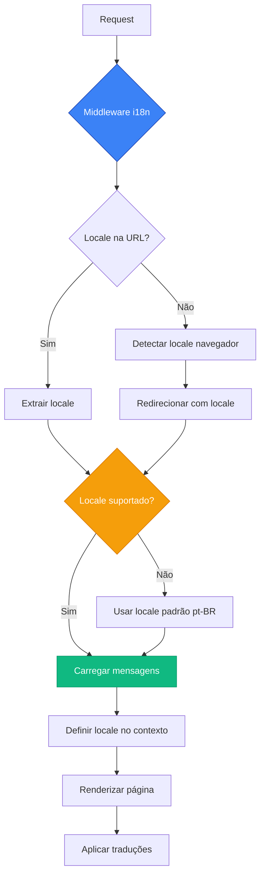
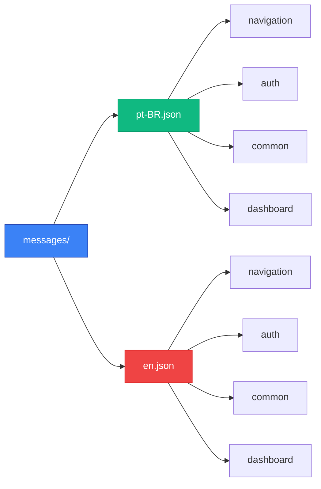

# Sistema de Internacionalização (i18n)

## 📋 Visão Geral

A aplicação utiliza **next-intl** para fornecer suporte completo à internacionalização, permitindo que usuários acessem a interface em múltiplos idiomas. O sistema está integrado com o App Router do Next.js 15 e oferece roteamento automático baseado em locale.

## 🌍 Locales Suportados

### Idiomas Disponíveis
- **pt-BR**: Português brasileiro (idioma padrão)
- **en**: Inglês

### Configuração de Locales
```typescript
// i18n/routing.ts
import { defineRouting } from 'next-intl/routing';

export const routing = defineRouting({
  locales: ['pt-BR', 'en'],
  defaultLocale: 'pt-BR',
  pathnames: {
    '/': '/',
    '/calendar': {
      'pt-BR': '/calendario',
      'en': '/calendar'
    },
    '/charts': {
      'pt-BR': '/graficos', 
      'en': '/charts'
    }
  }
});
```

## 📁 Estrutura de Arquivos

### Arquivos de Tradução
```
messages/
├── pt-BR.json          # Traduções em português
└── en.json             # Traduções em inglês
```

### Configuração i18n
```
src/i18n/
├── navigation.ts       # Navegação internacionalizada
├── request.ts          # Configuração de requisições
└── routing.ts          # Configuração de rotas
```

## 📝 Arquivos de Mensagens

### Estrutura dos Arquivos JSON
```json
// messages/pt-BR.json
{
  "navigation": {
    "dashboard": "Dashboard",
    "calendar": "Calendário",
    "charts": "Gráficos",
    "forms": "Formulários",
    "tables": "Tabelas",
    "profile": "Perfil",
    "settings": "Configurações"
  },
  "auth": {
    "signIn": "Entrar",
    "signUp": "Cadastrar",
    "signOut": "Sair",
    "email": "Email",
    "password": "Senha"
  },
  "common": {
    "loading": "Carregando...",
    "save": "Salvar",
    "cancel": "Cancelar",
    "delete": "Excluir",
    "edit": "Editar"
  }
}
```

```json
// messages/en.json
{
  "navigation": {
    "dashboard": "Dashboard",
    "calendar": "Calendar", 
    "charts": "Charts",
    "forms": "Forms",
    "tables": "Tables",
    "profile": "Profile",
    "settings": "Settings"
  },
  "auth": {
    "signIn": "Sign In",
    "signUp": "Sign Up", 
    "signOut": "Sign Out",
    "email": "Email",
    "password": "Password"
  },
  "common": {
    "loading": "Loading...",
    "save": "Save",
    "cancel": "Cancel",
    "delete": "Delete",
    "edit": "Edit"
  }
}
```

## 🗺️ Roteamento Internacionalizado

### App Router Structure
```
app/
├── [locale]/              # Parâmetro dinâmico para locale
│   ├── (home)/           # Dashboard
│   ├── auth/             # Autenticação
│   ├── calendar/         # Calendário
│   └── ...               # Outras páginas
```

### URLs Resultantes
```
# Português (padrão)
/pt-BR/
/pt-BR/calendario
/pt-BR/graficos
/pt-BR/formularios

# Inglês
/en/
/en/calendar
/en/charts
/en/forms
```

## ⚙️ Configuração do Sistema

### Fluxo de Internacionalização


### Estrutura de Mensagens


### Request Configuration
```typescript
// i18n/request.ts
import { getRequestConfig } from 'next-intl/server';
import { routing } from './routing';

export default getRequestConfig(async ({ locale }) => {
  if (!routing.locales.includes(locale as any)) {
    notFound();
  }

  return {
    messages: (await import(`../../messages/${locale}.json`)).default
  };
});
```

### Navigation Configuration
```typescript
// i18n/navigation.ts
import { createSharedPathnamesNavigation } from 'next-intl/navigation';
import { routing } from './routing';

export const { Link, redirect, usePathname, useRouter } =
  createSharedPathnamesNavigation(routing);
```

## 🔧 Middleware

### Configuração do Middleware
```typescript
// middleware.ts
import createMiddleware from 'next-intl/middleware';
import { routing } from './src/i18n/routing';

export default createMiddleware(routing);

export const config = {
  matcher: [
    '/((?!api|_next|_vercel|.*\\..*).*)' 
  ]
};
```

### Funcionalidades do Middleware
- **Detecção automática** de locale baseada no navegador
- **Redirecionamento** para locale padrão se necessário
- **Preservação** de parâmetros de query
- **Integração** com sistema de autenticação

## 🎨 Componentes Internacionalizados

### Language Switcher
```typescript
// components/language-switcher.tsx
'use client';

import { useLocale } from 'next-intl';
import { useRouter, usePathname } from '@/i18n/navigation';

export function LanguageSwitcher() {
  const locale = useLocale();
  const router = useRouter();
  const pathname = usePathname();

  const switchLanguage = (newLocale: string) => {
    router.replace(pathname, { locale: newLocale });
  };

  return (
    <div className="flex gap-2">
      <button 
        onClick={() => switchLanguage('pt-BR')}
        className={locale === 'pt-BR' ? 'active' : ''}
      >
        🇧🇷 PT
      </button>
      <button 
        onClick={() => switchLanguage('en')}
        className={locale === 'en' ? 'active' : ''}
      >
        🇺🇸 EN
      </button>
    </div>
  );
}
```

### Sidebar Internacionalizada
```typescript
// components/Layouts/sidebar/hooks/useInternationalizedRoutes.ts
import { useTranslations } from 'next-intl';

export function useInternationalizedRoutes() {
  const t = useTranslations('navigation');
  
  return [
    {
      label: t('dashboard'),
      route: '/',
      icon: <DashboardIcon />
    },
    {
      label: t('calendar'),
      route: '/calendar',
      icon: <CalendarIcon />
    }
    // ... mais rotas
  ];
}
```

## 📱 Uso em Componentes

### Hook useTranslations
```typescript
'use client';

import { useTranslations } from 'next-intl';

export function MyComponent() {
  const t = useTranslations('common');

  return (
    <div>
      <h1>{t('welcome')}</h1>
      <button>{t('save')}</button>
    </div>
  );
}
```

### Server Components
```typescript
import { getTranslations } from 'next-intl/server';

export default async function ServerComponent() {
  const t = await getTranslations('common');

  return (
    <div>
      <h1>{t('title')}</h1>
    </div>
  );
}
```

### Interpolação de Valores
```typescript
// messages/pt-BR.json
{
  "welcome": "Bem-vindo, {name}!",
  "itemCount": "Você tem {count} {count, plural, one {item} other {itens}}"
}

// Componente
const t = useTranslations();
<p>{t('welcome', { name: 'João' })}</p>
<p>{t('itemCount', { count: 5 })}</p>
```

## 🔗 Links Internacionalizados

### Link Component
```typescript
import { Link } from '@/i18n/navigation';

export function Navigation() {
  return (
    <nav>
      <Link href="/">{t('navigation.dashboard')}</Link>
      <Link href="/calendar">{t('navigation.calendar')}</Link>
      <Link href="/charts">{t('navigation.charts')}</Link>
    </nav>
  );
}
```

### Programmatic Navigation
```typescript
import { useRouter } from '@/i18n/navigation';

export function MyComponent() {
  const router = useRouter();

  const handleNavigation = () => {
    router.push('/calendar');
    // Automatically uses current locale
  };
}
```

## 📊 Formatação Localizada

### Números e Moedas
```typescript
import { useFormatter } from 'next-intl';

export function PriceDisplay({ amount }: { amount: number }) {
  const format = useFormatter();

  return (
    <div>
      <p>{format.number(amount, { style: 'currency', currency: 'BRL' })}</p>
      <p>{format.number(amount, { style: 'percent' })}</p>
    </div>
  );
}
```

### Datas e Horários
```typescript
import { useFormatter } from 'next-intl';

export function DateDisplay({ date }: { date: Date }) {
  const format = useFormatter();

  return (
    <div>
      <p>{format.dateTime(date, { dateStyle: 'full' })}</p>
      <p>{format.relativeTime(date)}</p>
    </div>
  );
}
```

## 🛠️ Desenvolvimento

### Adicionando Novas Traduções
1. **Adicione a chave** nos arquivos JSON:
```json
// messages/pt-BR.json
{
  "newSection": {
    "title": "Novo Título",
    "description": "Nova descrição"
  }
}

// messages/en.json  
{
  "newSection": {
    "title": "New Title",
    "description": "New description"
  }
}
```

2. **Use no componente**:
```typescript
const t = useTranslations('newSection');
<h1>{t('title')}</h1>
```

### Validação de Traduções
```bash
# Script para verificar chaves faltantes
npm run i18n:validate
```

### Extração Automática
```bash
# Extrair strings para tradução
npm run i18n:extract
```

## 🌐 SEO Internacionalizado

### Meta Tags
```typescript
// app/[locale]/layout.tsx
import { getTranslations } from 'next-intl/server';

export async function generateMetadata({ params: { locale } }) {
  const t = await getTranslations({ locale, namespace: 'metadata' });
  
  return {
    title: t('title'),
    description: t('description'),
    alternates: {
      languages: {
        'pt-BR': '/pt-BR',
        'en': '/en'
      }
    }
  };
}
```

### Sitemap Multilíngue
```typescript
// app/sitemap.ts
export default function sitemap() {
  return [
    {
      url: 'https://example.com/pt-BR',
      lastModified: new Date(),
      alternates: {
        languages: {
          'pt-BR': 'https://example.com/pt-BR',
          'en': 'https://example.com/en'
        }
      }
    }
  ];
}
```

## 📚 Melhores Práticas

### Organização de Traduções
- **Namespace por funcionalidade** (navigation, auth, forms)
- **Chaves hierárquicas** para organização
- **Consistência** entre idiomas
- **Contexto claro** nas chaves

### Performance
- **Code splitting** por namespace
- **Carregamento lazy** de traduções
- **Cache** de mensagens
- **Otimização** de bundle size

### Acessibilidade
- **lang attribute** automático
- **dir attribute** para RTL (futuro)
- **Screen reader** friendly
- **Keyboard navigation** mantida