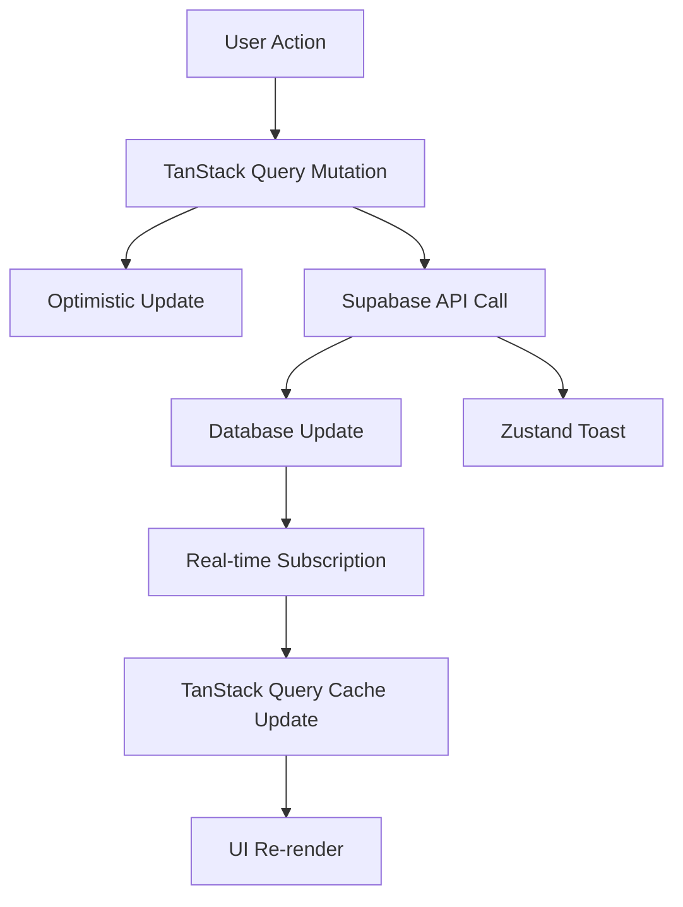

# 🔔 Sistema de Notificações em Tempo Real

## Visão Geral

O sistema de notificações em tempo real utiliza **TanStack Query** para gerenciamento de estado do servidor, **Supabase** para persistência e real-time, e **Zustand** para estado do cliente (toasts e UI), seguindo a arquitetura moderna estabelecida no projeto.

## 🏗️ Arquitetura

### Sistema de Três Camadas

1. **TanStack Query (Estado do Servidor)**
   - Cache inteligente de notificações
   - Optimistic updates com rollback automático
   - Background updates e sincronização
   - Estados de loading/error gerenciados automaticamente

2. **Supabase Real-time (Persistência)**
   - Armazenamento persistente no banco de dados
   - Subscriptions em tempo real via postgres_changes
   - Row Level Security (RLS) para segurança
   - Migrações e schema controlados

3. **Zustand (Estado do Cliente)**
   - Toasts temporários e feedback imediato
   - Preferências de UI e estado local
   - Sincronização com TanStack Query

### Fluxo de Dados



## 📊 Schema do Banco de Dados

```sql
CREATE TABLE notifications (
  id UUID PRIMARY KEY DEFAULT gen_random_uuid(),
  user_id TEXT NOT NULL,
  title TEXT NOT NULL,
  message TEXT NOT NULL,
  type TEXT NOT NULL DEFAULT 'info' CHECK (type IN ('info', 'success', 'warning', 'error')),
  read BOOLEAN NOT NULL DEFAULT FALSE,
  created_at TIMESTAMP WITH TIME ZONE DEFAULT NOW(),
  updated_at TIMESTAMP WITH TIME ZONE DEFAULT NOW(),
  
  -- Campos de metadata
  action_url TEXT,
  icon TEXT,
  sender_id TEXT,
  sender_name TEXT,
  sender_avatar TEXT
);

-- Índices para performance
CREATE INDEX idx_notifications_user_id ON notifications(user_id);
CREATE INDEX idx_notifications_user_read ON notifications(user_id, read);
CREATE INDEX idx_notifications_created_at ON notifications(created_at DESC);

-- Habilita RLS
ALTER TABLE notifications ENABLE ROW LEVEL SECURITY;

-- Adiciona à publicação em tempo real
ALTER PUBLICATION supabase_realtime ADD TABLE notifications;
```

## 🚀 Uso Básico

### Hook Principal com TanStack Query

```typescript
import { useRealtimeNotificationsQuery } from '@/hooks/useRealtimeNotificationsQuery';

export function NotificationComponent() {
  const {
    notifications,          // Cache TanStack Query - todas as notificações
    recentNotifications,    // Últimas 10 notificações
    unreadCount,           // Contagem de não lidas
    isLoading,             // Estado de carregamento inicial
    isFetching,            // Background updates
    error,                 // Estado de erro
    markAsRead,            // Mutation para marcar como lida
    markAllAsRead,         // Mutation para marcar todas
    deleteNotification,    // Mutation para deletar
    clearAll,              // Mutation para limpar todas
    isMarkingAsRead,       // Loading state da mutation
    isDeleting,            // Loading state da deletion
  } = useRealtimeNotificationsQuery();

  // Loading apenas no carregamento inicial
  if (isLoading) return <LoadingSpinner />;
  if (error) return <ErrorMessage error={error} />;

  return (
    <div>
      <div className="flex items-center gap-2">
        <h3>Notificações ({unreadCount} não lidas)</h3>
        {isFetching && <div className="text-sm text-blue-600">Atualizando...</div>}
      </div>
      
      {recentNotifications.map(notification => (
        <NotificationItem
          key={notification.id}
          notification={notification}
          onMarkRead={() => markAsRead(notification.id)}
          onDelete={() => deleteNotification(notification.id)}
          isMarkingAsRead={isMarkingAsRead}
          isDeleting={isDeleting}
        />
      ))}
    </div>
  );
}
```

### Criando Notificações com TanStack Query

```typescript
import { useNotificationCreator } from '@/hooks/useNotificationCreator';

export function CreateNotificationExample() {
  const { createNotification, isCreating, success, error } = useNotificationCreator();

  const handleOrderComplete = async (order) => {
    try {
      await createNotification({
        title: 'Pedido Confirmado!',
        message: `Seu pedido #${order.id} foi confirmado`,
        type: 'success',
        action_url: `/orders/${order.id}`,
        sender_name: 'Sistema da Loja',
      });
      // TanStack Query automaticamente:
      // 1. Faz optimistic update
      // 2. Envia para Supabase
      // 3. Atualiza cache
      // 4. Mostra toast via Zustand
    } catch (err) {
      // Automaticamente reverte optimistic update
      console.error('Failed to create notification:', err);
    }
  };

  return (
    <button 
      onClick={handleOrderComplete}
      disabled={isCreating}
    >
      {isCreating ? 'Processando...' : 'Finalizar Pedido'}
    </button>
  );
}

// Helpers para tipos comuns de notificação
export function NotificationHelpers() {
  const { success, error, warning, info, order, system } = useNotificationCreator();

  const examples = {
    // Notificação de sucesso rápida
    handleSuccess: () => success('Sucesso!', 'Operação concluída'),
    
    // Notificação de erro
    handleError: () => error('Erro', 'Algo deu errado'),
    
    // Notificação de pedido específica
    handleOrder: (orderId: string) => order(
      orderId, 
      'Pedido Atualizado', 
      'Status alterado para "Em processamento"',
      'info'
    ),
    
    // Notificação do sistema
    handleSystem: () => system('Manutenção', 'Sistema será atualizado às 2h'),
  };

  return examples;
}
```

### Usando Toasts

```typescript
import { useShowToast } from '@/store';

export function ToastExample() {
  const showToast = useShowToast();

  const handleAction = () => {
    showToast({
      type: 'success',
      title: 'Ação Concluída',
      message: 'Sua ação foi executada com sucesso!',
      duration: 3000,
    });
  };

  return (
    <button onClick={handleAction}>
      Executar Ação
    </button>
  );
}
```

## 🎨 Componentes de UI

### Estados de Carregamento

```typescript
import { 
  NotificationLoading, 
  ErrorState, 
  EmptyState 
} from '@/components/ui/loading-states';

// Carregamento com contexto de notificação
<NotificationLoading message="Carregando suas notificações..." />

// Estado de erro com funcionalidade de retry
<ErrorState
  title="Falha ao carregar"
  message={error}
  onRetry={() => refetch()}
/>

// Estado vazio com call-to-action
<EmptyState
  title="Nenhuma notificação"
  description="Você está em dia!"
  action={{
    label: "Atualizar",
    onClick: () => refetch()
  }}
/>
```

### Componente de Notificação Aprimorado

```typescript
export function EnhancedNotificationDropdown() {
  const {
    notifications,
    unreadCount,
    markAsRead,
    markAllAsRead,
  } = useRealtimeNotifications();

  return (
    <Dropdown>
      <DropdownTrigger className="relative">
        <BellIcon />
        {unreadCount > 0 && (
          <span className="absolute -top-1 -right-1 bg-red-500 text-white rounded-full text-xs px-1">
            {unreadCount > 99 ? '99+' : unreadCount}
          </span>
        )}
      </DropdownTrigger>
      
      <DropdownContent>
        <div className="p-4">
          <div className="flex justify-between items-center mb-3">
            <h3>Notificações</h3>
            {unreadCount > 0 && (
              <button onClick={markAllAsRead} className="text-blue-600">
                Marcar todas como lidas
              </button>
            )}
          </div>
          
          <div className="space-y-2">
            {notifications.map(notification => (
              <NotificationItem
                key={notification.id}
                notification={notification}
                onClick={() => markAsRead(notification.id)}
              />
            ))}
          </div>
        </div>
      </DropdownContent>
    </Dropdown>
  );
}
```

## 🎯 Vantagens do TanStack Query

### Benefícios sobre Implementação Anterior

1. **Cache Inteligente**
   - Dados em cache por 30 segundos (configurável)
   - Background updates automáticos
   - Deduplicação de requests

2. **Optimistic Updates**
   - UI atualiza instantaneamente
   - Rollback automático em caso de erro
   - Melhor UX sem loading desnecessário

3. **Estados de Loading Granulares**
   ```typescript
   const {
     isLoading,        // Carregamento inicial
     isFetching,       // Background updates
     isMarkingAsRead,  // Loading específico da ação
     isDeleting,       // Loading específico da ação
   } = useRealtimeNotificationsQuery();
   ```

4. **Error Handling Robusto**
   - Retry automático configurável
   - Error boundaries integradas
   - Recovery automático

5. **DevTools e Debug**
   - React Query DevTools integradas
   - Timeline de requests
   - Cache inspection

### Comparação de Performance

| Aspecto | Implementação Anterior | TanStack Query |
|---------|----------------------|----------------|
| Cache | Manual (useState) | Automático + inteligente |
| Loading States | Manual (boolean) | Granular + automático |
| Error Handling | Manual + toast | Automático + retry |
| Optimistic Updates | Manual + rollback | Automático + rollback |
| Memory Leaks | Possível (subscriptions) | Prevenido automaticamente |
| Re-renders | Frequentes (object selectors) | Otimizados (selective) |

## ⚡ Tempo Real

### Configuração de Subscriptions

```typescript
// Dentro do hook useNotificationsQuery - integração automática com TanStack Query
useEffect(() => {
  if (!user?.id) return;

  const channel = supabase
    .channel('notifications-realtime')
    .on(
      'postgres_changes',
      {
        event: '*',
        schema: 'public',
        table: 'notifications',
        filter: `user_id=eq.${user.id}`,
      },
      (payload) => {
        const queryKey = notificationKeys.list(user.id);
        
        if (payload.eventType === 'INSERT') {
          // 🚀 Atualiza cache TanStack Query otimisticamente
          queryClient.setQueryData(queryKey, (old: Notification[] = []) => [
            payload.new as Notification,
            ...old.slice(0, 49) // Mantém máximo 50 notificações
          ]);
          
          // 📱 Toast + Zustand para feedback imediato
          showToast({
            type: newNotification.type,
            title: newNotification.title,
            message: newNotification.message,
          });
          
        } else if (payload.eventType === 'UPDATE') {
          // 🔄 Update específico no cache - granular
          queryClient.setQueryData(queryKey, (old: Notification[] = []) =>
            old.map(n => n.id === payload.new.id ? payload.new : n)
          );
          
        } else if (payload.eventType === 'DELETE') {
          // 🗑️ Remove do cache automaticamente
          queryClient.setQueryData(queryKey, (old: Notification[] = []) =>
            old.filter(n => n.id !== payload.old.id)
          );
        }
      }
    )
    .subscribe();

  // ✅ Cleanup automático - previne memory leaks
  return () => supabase.removeChannel(channel);
}, [user?.id, queryClient, supabase]);
```

### Sincronização Entre Abas

As notificações são automaticamente sincronizadas entre abas do navegador através das subscriptions em tempo real do Supabase, com cache TanStack Query compartilhado entre todas as instâncias.

## 📁 Estrutura dos Arquivos

### Nova Organização com TanStack Query

```
src/hooks/
├── api/
│   └── notifications.ts              # ✅ API functions (CRUD operations)
├── queries/
│   └── useNotifications.ts           # ✅ TanStack Query hooks
├── mutations/
│   └── useNotificationMutations.ts   # ✅ Mutations (create, update, delete)
├── useRealtimeNotificationsQuery.ts  # ✅ Main hook (replaces old)
├── useNotificationCreator.ts         # ✅ Helper for creating notifications
└── useRealtimeNotifications.ts       # ⚠️ Legacy (compatibility only)
```

### Vantagens da Nova Estrutura

1. **Separação de Responsabilidades**
   - `/api/` - Funções puras do Supabase
   - `/queries/` - Leitura de dados com cache
   - `/mutations/` - Operações de escrita com optimistic updates

2. **Reutilização e Testabilidade**
   ```typescript
   // API functions podem ser testadas isoladamente
   import { notificationsApi } from '@/hooks/api/notifications';
   
   // Queries e mutations podem ser mockadas facilmente
   import { useNotificationsQuery } from '@/hooks/queries/useNotifications';
   ```

3. **Type Safety Completa**
   ```typescript
   // Tipos derivados do schema Supabase
   import type { Notification, NotificationInsert } from '@/hooks/api/notifications';
   ```

## 🔧 Configuração

### Variáveis de Ambiente

```env
NEXT_PUBLIC_SUPABASE_URL=sua_url_do_supabase
NEXT_PUBLIC_SUPABASE_ANON_KEY=sua_chave_anonima
SUPABASE_SERVICE_ROLE_KEY=sua_chave_service_role
```

### Políticas RLS

```sql
-- Usuários podem ver apenas suas próprias notificações
CREATE POLICY "Users can view own notifications" ON notifications
  FOR SELECT USING (auth.jwt() ->> 'sub' = user_id);

-- Usuários podem inserir suas próprias notificações
CREATE POLICY "Users can insert own notifications" ON notifications
  FOR INSERT WITH CHECK (auth.jwt() ->> 'sub' = user_id);

-- Usuários podem atualizar suas próprias notificações
CREATE POLICY "Users can update own notifications" ON notifications
  FOR UPDATE USING (auth.jwt() ->> 'sub' = user_id);

-- Usuários podem deletar suas próprias notificações
CREATE POLICY "Users can delete own notifications" ON notifications
  FOR DELETE USING (auth.jwt() ->> 'sub' = user_id);
```

## 📊 Performance

### Otimizações Implementadas

1. **Seletores Individuais**: Evitam re-renders desnecessários
2. **Atualizações Otimistas**: Feedback imediato na UI
3. **Limite de Notificações**: Máximo de 50 notificações por usuário
4. **Cleanup Automático**: Limpeza de subscriptions ao desmontar
5. **Paginação Inteligente**: Carrega notificações recentes primeiro

### Gerenciamento de Memória

```typescript
// Cleanup automático de subscriptions
useEffect(() => {
  const channel = supabase.channel('notifications');
  
  // ... configuração da subscription
  
  return () => {
    // Importante: sempre limpar subscriptions
    supabase.removeChannel(channel);
  };
}, []);
```

## 🧪 Testes

### Componente de Teste

```typescript
import { NotificationTester } from '@/components/test/NotificationTester';

export function TestPage() {
  return (
    <div>
      <h1>Teste do Sistema de Notificações</h1>
      <NotificationTester />
    </div>
  );
}
```

### Checklist de Testes

- [ ] Notificações toast aparecem e desaparecem corretamente
- [ ] Notificações persistentes são armazenadas no banco
- [ ] Atualizações em tempo real funcionam entre abas
- [ ] Contagem de não lidas atualiza corretamente
- [ ] Funcionalidade "marcar como lida" funciona
- [ ] Deletar notificações funciona
- [ ] Estados de erro são exibidos adequadamente
- [ ] Estados de carregamento funcionam
- [ ] Responsividade mobile funciona
- [ ] Modo escuro funciona

## 🚨 Melhores Práticas

### ✅ Faça

- Use `useRealtimeNotifications` para notificações persistentes
- Use `useShowToast` para feedback temporário
- Siga os padrões de gerenciamento de estado
- Implemente tratamento de erro adequado
- Teste funcionalidade em tempo real

### ❌ Evite

- Não use chamadas diretas ao Supabase para notificações
- Não contorne a camada de gerenciamento de estado
- Não crie notificações sem contexto de usuário
- Não ignore estados de carregamento e erro
- Não esqueça de testar sincronização entre abas

## 🔮 Melhorias Futuras

- 📧 **Integração de Email**: Notificações opcionais por email
- 🔕 **Preferências de Notificação**: Configurações personalizáveis pelo usuário
- 📱 **Push Notifications**: Suporte a notificações push do navegador
- 🏷️ **Categorias de Notificação**: Tipos agrupados de notificações
- 📊 **Analytics**: Métricas de engajamento de notificações

## 📚 Referências

- [Gerenciamento de Estado](/docs/04-architecture/state-management.md)
- [Zustand](/docs/05-features/zustand-state-management.md)
- [Integração Supabase](/docs/05-features/supabase-integration.md)
- [TanStack Query](/docs/05-features/tanstack-query.md)

---

Este sistema de notificações fornece uma base sólida para comunicação em tempo real com os usuários, mantendo excelente performance e seguindo padrões arquiteturais estabelecidos.