# Deploy e Produção

## 📋 Visão Geral

Este guia detalha o processo de deploy da aplicação para diferentes ambientes de produção, incluindo configurações necessárias, otimizações e monitoramento.

## 🚀 Plataformas de Deploy

### Vercel (Recomendado)

#### Configuração Básica
```json
// vercel.json
{
  "buildCommand": "npm run build",
  "outputDirectory": ".next",
  "framework": "nextjs",
  "functions": {
    "app/api/**/*.ts": {
      "maxDuration": 30
    }
  },
  "regions": ["gru1"],
  "env": {
    "NODE_ENV": "production"
  }
}
```

#### Deploy via CLI
```bash
# Instalar Vercel CLI
npm install -g vercel

# Login na Vercel
vercel login

# Deploy inicial (configura o projeto)
vercel

# Deploy de produção
vercel --prod

# Deploy com alias customizado
vercel --prod --alias minha-app.vercel.app
```

#### Deploy via GitHub
1. **Conectar repositório** no dashboard da Vercel
2. **Configurar variáveis** de ambiente
3. **Deploy automático** em cada push para main

#### Variáveis de Ambiente
```bash
# No dashboard da Vercel, adicionar:
NEXT_PUBLIC_CLERK_PUBLISHABLE_KEY=pk_live_...
CLERK_SECRET_KEY=sk_live_...
NEXT_PUBLIC_CLERK_SIGN_IN_URL=/auth/sign-in
NEXT_PUBLIC_CLERK_SIGN_UP_URL=/auth/sign-up
NEXT_PUBLIC_CLERK_SIGN_IN_FORCE_REDIRECT_URL=/app
NEXT_PUBLIC_CLERK_SIGN_UP_FORCE_REDIRECT_URL=/app

# URLs da aplicação
NEXT_PUBLIC_APP_URL=https://minha-app.vercel.app
```

### Netlify

#### Configuração
```toml
# netlify.toml
[build]
  command = "npm run build"
  publish = ".next"

[build.environment]
  NODE_VERSION = "18"

[[redirects]]
  from = "/*"
  to = "/index.html"
  status = 200
```

### Railway

#### Configuração
```dockerfile
# Dockerfile para Railway
FROM node:18-alpine AS deps
RUN apk add --no-cache libc6-compat
WORKDIR /app
COPY package.json package-lock.json ./
RUN npm ci --only=production

FROM node:18-alpine AS builder
WORKDIR /app
COPY --from=deps /app/node_modules ./node_modules
COPY . .
RUN npm run build

FROM node:18-alpine AS runner
WORKDIR /app
ENV NODE_ENV production
RUN addgroup --system --gid 1001 nodejs
RUN adduser --system --uid 1001 nextjs

COPY --from=builder /app/public ./public
COPY --from=builder --chown=nextjs:nodejs /app/.next/standalone ./
COPY --from=builder --chown=nextjs:nodejs /app/.next/static ./.next/static

USER nextjs
EXPOSE 3000
ENV PORT 3000

CMD ["node", "server.js"]
```

## 🐳 Docker

### Multi-stage Dockerfile
```dockerfile
# Dockerfile
FROM node:18-alpine AS base

# Install dependencies only when needed
FROM base AS deps
RUN apk add --no-cache libc6-compat
WORKDIR /app

# Install dependencies based on the preferred package manager
COPY package.json yarn.lock* package-lock.json* pnpm-lock.yaml* ./
RUN \
  if [ -f yarn.lock ]; then yarn --frozen-lockfile; \
  elif [ -f package-lock.json ]; then npm ci; \
  elif [ -f pnpm-lock.yaml ]; then yarn global add pnpm && pnpm i --frozen-lockfile; \
  else echo "Lockfile not found." && exit 1; \
  fi

# Rebuild the source code only when needed
FROM base AS builder
WORKDIR /app
COPY --from=deps /app/node_modules ./node_modules
COPY . .

# Disable telemetry during the build
ENV NEXT_TELEMETRY_DISABLED 1

RUN npm run build

# Production image, copy all the files and run next
FROM base AS runner
WORKDIR /app

ENV NODE_ENV production
ENV NEXT_TELEMETRY_DISABLED 1

RUN addgroup --system --gid 1001 nodejs
RUN adduser --system --uid 1001 nextjs

COPY --from=builder /app/public ./public

# Set the correct permission for prerender cache
RUN mkdir .next
RUN chown nextjs:nodejs .next

# Automatically leverage output traces to reduce image size
COPY --from=builder --chown=nextjs:nodejs /app/.next/standalone ./
COPY --from=builder --chown=nextjs:nodejs /app/.next/static ./.next/static

USER nextjs

EXPOSE 3000

ENV PORT 3000

CMD ["node", "server.js"]
```

### Docker Compose
```yaml
# docker-compose.yml
version: '3.8'

services:
  app:
    build: .
    ports:
      - "3000:3000"
    environment:
      - NODE_ENV=production
      - NEXT_PUBLIC_CLERK_PUBLISHABLE_KEY=${NEXT_PUBLIC_CLERK_PUBLISHABLE_KEY}
      - CLERK_SECRET_KEY=${CLERK_SECRET_KEY}
    env_file:
      - .env.local
    restart: unless-stopped

  nginx:
    image: nginx:alpine
    ports:
      - "80:80"
      - "443:443"
    volumes:
      - ./nginx.conf:/etc/nginx/nginx.conf
      - ./ssl:/etc/nginx/ssl
    depends_on:
      - app
    restart: unless-stopped
```

## ⚙️ Configurações de Produção

### Next.js Configuration
```javascript
// next.config.mjs
/** @type {import('next').NextConfig} */
const nextConfig = {
  // Otimizações de produção
  compress: true,
  poweredByHeader: false,
  
  // Otimização de imagens
  images: {
    formats: ['image/avif', 'image/webp'],
    deviceSizes: [640, 750, 828, 1080, 1200, 1920, 2048, 3840],
    imageSizes: [16, 32, 48, 64, 96, 128, 256, 384],
    remotePatterns: [
      {
        protocol: 'https',
        hostname: 'clerk.com',
      },
    ],
  },
  
  // Headers de segurança
  async headers() {
    return [
      {
        source: '/(.*)',
        headers: [
          {
            key: 'X-Frame-Options',
            value: 'DENY',
          },
          {
            key: 'X-Content-Type-Options',
            value: 'nosniff',
          },
          {
            key: 'Referrer-Policy',
            value: 'origin-when-cross-origin',
          },
          {
            key: 'Strict-Transport-Security',
            value: 'max-age=31536000; includeSubDomains; preload',
          },
        ],
      },
    ];
  },
  
  // Experimental features
  experimental: {
    serverComponentsExternalPackages: ['@clerk/nextjs'],
  },
  
  // Bundle analyzer (desenvolvimento)
  ...(process.env.ANALYZE === 'true' && {
    bundleAnalyzer: {
      enabled: true,
    },
  }),
};

export default nextConfig;
```

### Environment Variables
```bash
# .env.production
NODE_ENV=production
NEXT_TELEMETRY_DISABLED=1

# Clerk (Production Keys)
NEXT_PUBLIC_CLERK_PUBLISHABLE_KEY=pk_live_...
CLERK_SECRET_KEY=sk_live_...

# URLs de produção
NEXT_PUBLIC_APP_URL=https://meuapp.com
NEXT_PUBLIC_CLERK_SIGN_IN_URL=/auth/sign-in
NEXT_PUBLIC_CLERK_SIGN_UP_URL=/auth/sign-up
NEXT_PUBLIC_CLERK_SIGN_IN_FORCE_REDIRECT_URL=/app
NEXT_PUBLIC_CLERK_SIGN_UP_FORCE_REDIRECT_URL=/app

# Analytics (opcional)
NEXT_PUBLIC_GA_ID=G-...
NEXT_PUBLIC_HOTJAR_ID=...

# Supabase
NEXT_PUBLIC_SUPABASE_URL=https://your-project-ref.supabase.co
NEXT_PUBLIC_SUPABASE_ANON_KEY=eyJhbGciOiJIUzI1NiIsInR5cCI6IkpXVCJ9...
SUPABASE_SERVICE_ROLE_KEY=eyJhbGciOiJIUzI1NiIsInR5cCI6IkpXVCJ9...

# External APIs
API_BASE_URL=https://api.meuapp.com
```

## 🔒 SSL e Segurança

### Nginx Configuration
```nginx
# nginx.conf
server {
    listen 80;
    server_name meuapp.com www.meuapp.com;
    return 301 https://$server_name$request_uri;
}

server {
    listen 443 ssl http2;
    server_name meuapp.com www.meuapp.com;

    ssl_certificate /etc/nginx/ssl/cert.pem;
    ssl_certificate_key /etc/nginx/ssl/key.pem;
    ssl_protocols TLSv1.2 TLSv1.3;
    ssl_ciphers HIGH:!aNULL:!MD5;

    # Security headers
    add_header X-Frame-Options DENY;
    add_header X-Content-Type-Options nosniff;
    add_header X-XSS-Protection "1; mode=block";
    add_header Strict-Transport-Security "max-age=31536000; includeSubDomains; preload";

    # Gzip compression
    gzip on;
    gzip_vary on;
    gzip_min_length 1024;
    gzip_types
        text/plain
        text/css
        text/xml
        text/javascript
        application/javascript
        application/xml+rss
        application/json;

    location / {
        proxy_pass http://app:3000;
        proxy_http_version 1.1;
        proxy_set_header Upgrade $http_upgrade;
        proxy_set_header Connection 'upgrade';
        proxy_set_header Host $host;
        proxy_set_header X-Real-IP $remote_addr;
        proxy_set_header X-Forwarded-For $proxy_add_x_forwarded_for;
        proxy_set_header X-Forwarded-Proto $scheme;
        proxy_cache_bypass $http_upgrade;
    }

    # Cache static assets
    location /_next/static/ {
        proxy_pass http://app:3000;
        expires 1y;
        add_header Cache-Control "public, immutable";
    }
}
```

### Let's Encrypt SSL
```bash
# Instalar Certbot
sudo apt install certbot python3-certbot-nginx

# Obter certificado
sudo certbot --nginx -d meuapp.com -d www.meuapp.com

# Renovação automática
sudo crontab -e
# Adicionar: 0 12 * * * /usr/bin/certbot renew --quiet
```

## 📊 Monitoramento e Analytics

### Performance Monitoring
```typescript
// lib/analytics.ts
export function reportWebVitals(metric: any) {
  if (process.env.NODE_ENV === 'production') {
    // Google Analytics
    if (window.gtag) {
      window.gtag('event', metric.name, {
        event_category: 'Web Vitals',
        value: Math.round(metric.value),
        event_label: metric.id,
        non_interaction: true,
      });
    }
    
    // Vercel Analytics
    if (window.va) {
      window.va('track', metric.name, {
        value: metric.value,
        label: metric.id,
      });
    }
  }
}
```

### Error Tracking com Sentry
```typescript
// lib/sentry.ts
import * as Sentry from '@sentry/nextjs';

Sentry.init({
  dsn: process.env.NEXT_PUBLIC_SENTRY_DSN,
  environment: process.env.NODE_ENV,
  tracesSampleRate: 1.0,
  integrations: [
    new Sentry.BrowserTracing(),
  ],
});

export { Sentry };
```

### Uptime Monitoring
```typescript
// pages/api/health.ts
export default function handler(req: any, res: any) {
  const healthCheck = {
    uptime: process.uptime(),
    message: 'OK',
    timestamp: Date.now(),
  };
  
  try {
    res.status(200).json(healthCheck);
  } catch (error) {
    healthCheck.message = error;
    res.status(503).json(healthCheck);
  }
}
```

## 🚦 CI/CD Pipeline

### Fluxo de Deploy


### Pipeline de CI/CD

```mermaid
flowchart TD
    A[Push to main] --> B[GitHub Actions]
    B --> C[Install Dependencies]
    C --> D[Run Tests]
    D --> E[Type Check]
    E --> F[Linting]
    F --> G{All checks pass?}
    G -->|No| H[❌ Build Failed]
    G -->|Yes| I[Build App]
    I --> J[Deploy to Vercel]
    J --> K[✅ Production]
    
    K --> L[Health Check]
    L --> M[Notify Team]
    
    style G fill:#f59e0b,stroke:#d97706,color:#fff
    style H fill:#ef4444,stroke:#dc2626,color:#fff
    style K fill:#10b981,stroke:#059669,color:#fff
```


### GitHub Actions
```yaml
# .github/workflows/deploy.yml
name: Deploy to Production

on:
  push:
    branches: [main]

jobs:
  test:
    runs-on: ubuntu-latest
    steps:
      - uses: actions/checkout@v3
      - uses: actions/setup-node@v3
        with:
          node-version: '18'
          cache: 'npm'
      
      - name: Install dependencies
        run: npm ci
      
      - name: Run tests
        run: npm test
      
      - name: Run linting
        run: npm run lint
      
      - name: Type check
        run: npm run type-check

  build-and-deploy:
    needs: test
    runs-on: ubuntu-latest
    steps:
      - uses: actions/checkout@v3
      
      - name: Deploy to Vercel
        uses: amondnet/vercel-action@v20
        with:
          vercel-token: ${{ secrets.VERCEL_TOKEN }}
          vercel-org-id: ${{ secrets.VERCEL_ORG_ID }}
          vercel-project-id: ${{ secrets.VERCEL_PROJECT_ID }}
          vercel-args: '--prod'
```

### GitLab CI
```yaml
# .gitlab-ci.yml
image: node:18

stages:
  - test
  - build
  - deploy

cache:
  paths:
    - node_modules/

test:
  stage: test
  script:
    - npm ci
    - npm run lint
    - npm run type-check
    - npm test

build:
  stage: build
  script:
    - npm ci
    - npm run build
  artifacts:
    paths:
      - .next/
    expire_in: 1 hour

deploy:
  stage: deploy
  script:
    - echo "Deploy to production"
  only:
    - main
```

## 📈 Performance Optimization

### Build Analysis
```bash
# Analisar bundle
ANALYZE=true npm run build

# Bundle analyzer
npm install -g @next/bundle-analyzer
```

### Lighthouse CI
```yaml
# .github/workflows/lighthouse.yml
name: Lighthouse CI

on: [push]

jobs:
  lighthouse:
    runs-on: ubuntu-latest
    steps:
      - uses: actions/checkout@v3
      - uses: actions/setup-node@v3
        with:
          node-version: '18'
      
      - name: Install dependencies
        run: npm ci
      
      - name: Build app
        run: npm run build
      
      - name: Run Lighthouse CI
        run: |
          npm install -g @lhci/cli@0.12.x
          lhci autorun
```

```json
// lighthouserc.js
module.exports = {
  ci: {
    collect: {
      url: ['http://localhost:3000'],
      startServerCommand: 'npm start',
    },
    assert: {
      preset: 'lighthouse:recommended',
      assertions: {
        'categories:performance': ['warn', { minScore: 0.9 }],
        'categories:accessibility': ['error', { minScore: 0.9 }],
        'categories:best-practices': ['warn', { minScore: 0.9 }],
        'categories:seo': ['warn', { minScore: 0.9 }],
      },
    },
  },
};
```

## 🔧 Troubleshooting

### Build Issues
```bash
# Limpar cache
rm -rf .next node_modules package-lock.json
npm install

# Verificar dependências
npm audit
npm audit fix

# Build local
npm run build
npm start
```

### Deployment Issues
- **Verificar variáveis** de ambiente
- **Confirmar URLs** de callback no Clerk
- **Testar em modo incógnito** para sessões limpas
- **Verificar logs** da plataforma de deploy

### Performance Issues
- **Analisar Core Web Vitals**
- **Otimizar imagens** com next/image
- **Implementar lazy loading**
- **Revisar bundle size**

## 📚 Checklist de Deploy

### Pré-Deploy
- [ ] Testes passando
- [ ] Build local funcionando
- [ ] Variáveis de ambiente configuradas
- [ ] SSL configurado
- [ ] Domínio apontado

### Pós-Deploy
- [ ] Site acessível
- [ ] Autenticação funcionando
- [ ] Formulários enviando
- [ ] Analytics configurado
- [ ] Monitoramento ativo
- [ ] Backup configurado